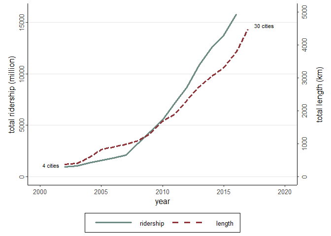
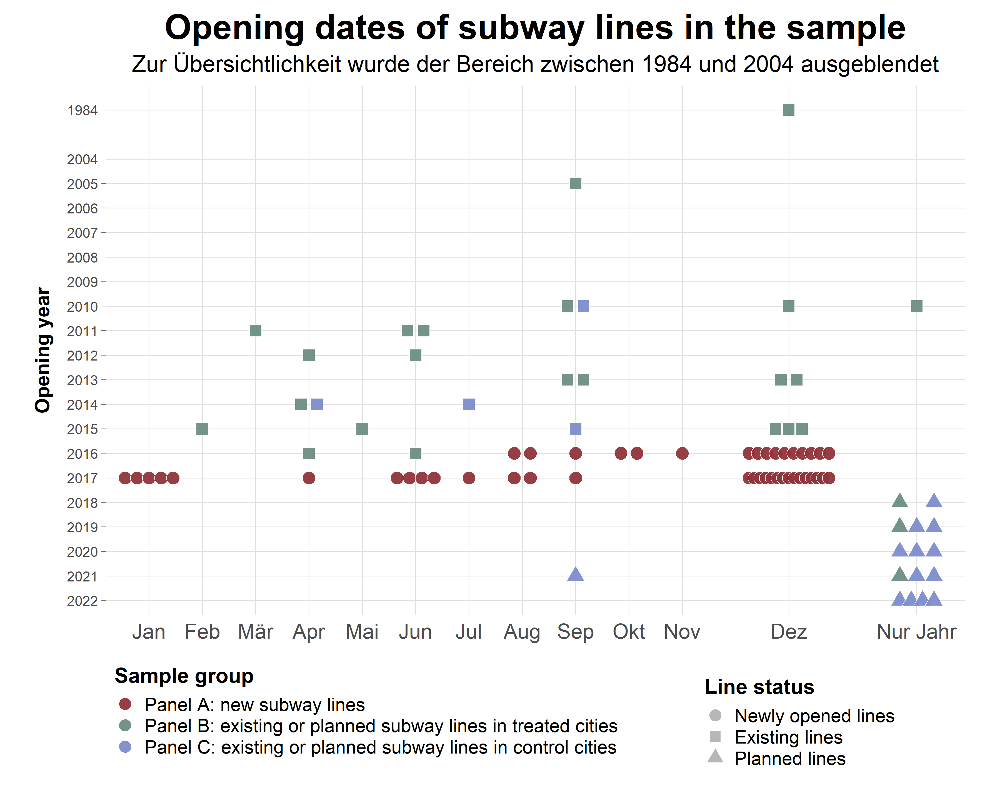
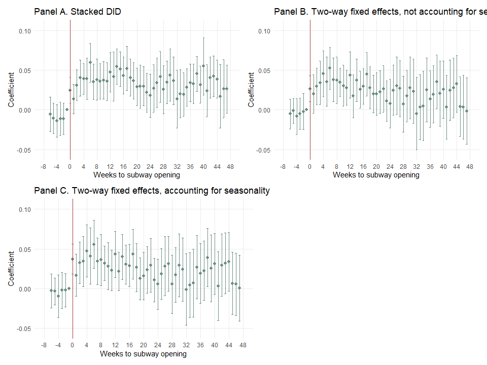
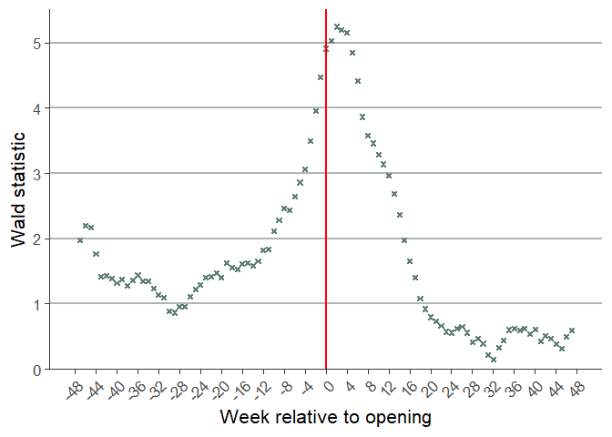
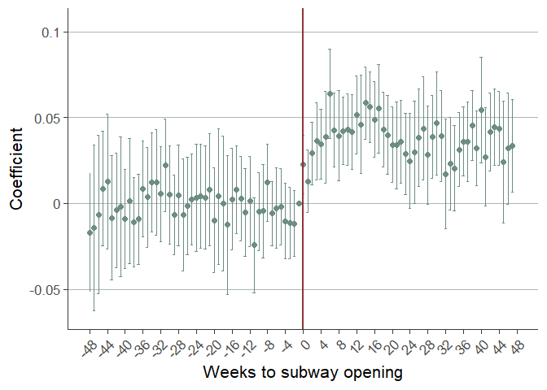
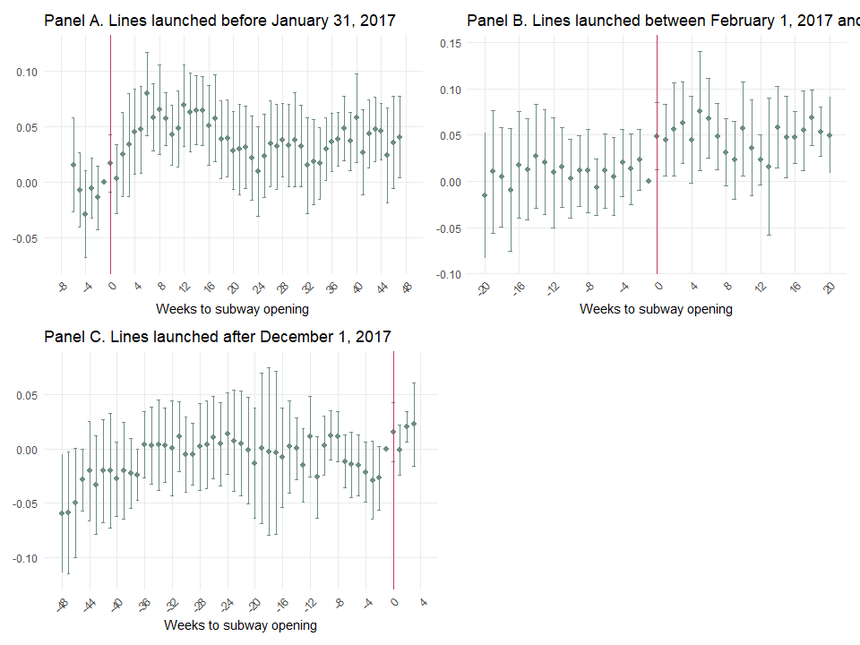
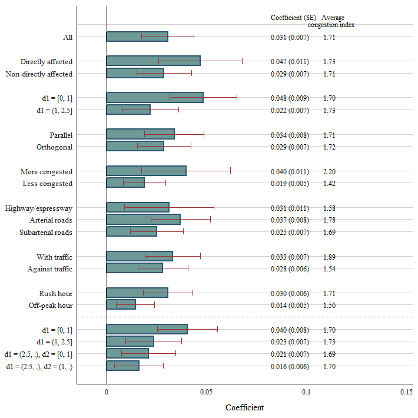
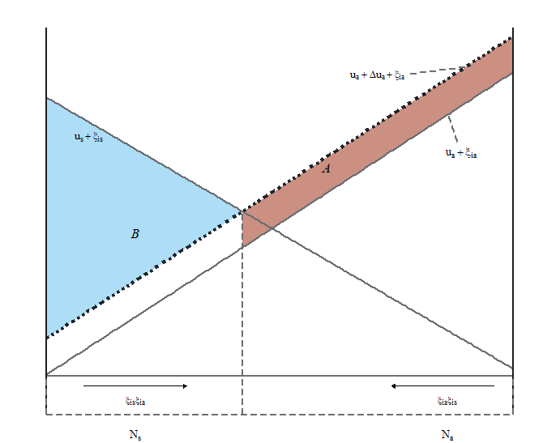

# 0 Überblick

### Zusammenfassung

In ihrem Paper *Subways and Road Congestion* untersuchen Yizhen Gu, Chang Jiang, Junfu Zhang und Ben Zou, ob der Ausbau von U-Bahn-Systemen tatsächlich dazu beitragen kann, Straßenverkehr in chinesischen Städten zu entlasten. Die Studie setzt dabei an einem zentralen verkehrsökonomischen Problem an: Viele schnell wachsende Städte leiden unter zunehmendem Stau, gleichzeitig werden U-Bahnen häufig als Lösung zur Reduktion von Verkehrsbelastung betrachtet.

Besonders relevant ist der chinesische Kontext, da China in den vergangenen Jahren einen massiven Ausbau städtischer U-Bahn-Netze erlebt hat. Zwischen 2001 und 2017 stieg die Gesamtlänge der U-Bahn-Linien in China stark an, während gleichzeitig Bevölkerung, Autobesitz und Verkehrsaufkommen in vielen Großstädten zunahmen. Dadurch entsteht ein geeigneter empirischer Rahmen, um den Effekt neuer U-Bahn-Linien auf den Straßenverkehr zu untersuchen.

Für ihre Analyse nutzen die Autoren Daten zu 45 neu eröffneten U-Bahn-Linien in 25 chinesischen Städten im Zeitraum von August 2016 bis Dezember 2017. Diese Informationen kombinieren sie mit hochfrequenten Verkehrsdaten von Baidu Maps, die stündliche Geschwindigkeitsmessungen auf Ebene einzelner Straßenabschnitte enthalten. Dadurch können die Autoren sehr genau beobachten, wie sich die Fahrgeschwindigkeit auf Straßen in der Nähe neuer U-Bahn-Linien vor und nach deren Eröffnung verändert.

Methodisch basiert die Studie auf einem Difference-in-Differences-Ansatz. Dabei werden Straßenabschnitte, die direkt von einer neuen U-Bahn-Linie betroffen sein könnten, mit Kontrollstraßen in Städten verglichen, in denen im Untersuchungszeitraum keine neue U-Bahn-Linie eröffnet wurde. Ziel ist es, den kausalen Effekt der U-Bahn-Eröffnung auf die Verkehrsgeschwindigkeit zu isolieren und allgemeine zeitliche Entwicklungen oder saisonale Muster möglichst herauszurechnen.

##### Zentrale Ergebnisse

Die Autoren kommen zu dem Ergebnis, dass neue U-Bahn-Linien den Straßenverkehr zumindest kurzfristig messbar entlasten. Im ersten Jahr nach der Eröffnung steigt die Geschwindigkeit auf direkt betroffenen Straßen während der Stoßzeiten um durchschnittlich etwa vier Prozent. Der Effekt ist besonders ausgeprägt auf zuvor stark überlasteten Straßen und nimmt mit zunehmender Entfernung zur neuen U-Bahn-Linie ab. Ergänzende Analysen aus Beijing deuten außerdem darauf hin, dass eine bessere U-Bahn-Anbindung mit mehr U-Bahn-Fahrten sowie weniger Bus- und Autofahrten verbunden ist.

### Replikationsumfang

Der Replikationsumfang umfasst einen großen Teil der zentralen empirischen Analysen des Papers. Repliziert wurden sowohl die deskriptiven Grundlagen der Studie als auch das Hauptergebnis, die dynamischen Effekte, mehrere Robustheits- und Timing-Checks sowie die heterogenen Effekte nach Straßenmerkmalen. Table 1 wurde nicht als empirische Tabelle repliziert, sondern als eigene Grafik auf Basis der tabellarischen Linienauflistung visualisiert, um das Treatment Timing und das CNY-Problem anschaulicher darzustellen. Table 6 konnte dagegen nicht repliziert werden, weil die dafür benötigten Individual- und Haushaltsdaten nicht im Replikationspaket enthalten waren. Figure 7 wurde ohne Datengrundlage nachgebildet, da es sich um eine schematische Darstellung der ökonomischen Interpretation handelt.

| Element  | Status                       | Rolle im Report                                                                                        |
| -------- | ---------------------------- | ------------------------------------------------------------------------------------------------------ |
| Figure 1 | repliziert                   | Kontext: chinesischer U-Bahn-Boom                                                                      |
| Figure 2 | repliziert                   | Dynamisches Hauptergebnis / Event-Study-Darstellung                                                    |
| Figure 3 | repliziert                   | Placebo Timing / Robustheit                                                                            |
| Figure 4 | repliziert                   | Längerer Pre-Treatment-Zeitraum / Pre-Trend-Robustheit                                                 |
| Figure 5 | repliziert                   | Timing-Robustheit / CNY-Problematik                                                                    |
| Figure 6 | repliziert                   | Heterogene Effekte / Mechanismus und Robustheit                                                        |
| Figure 7 | ohne Daten repliziert        | Schematische ökonomische Interpretation                                                                |
| Table 1  | Grafik basierend auf Tabelle | Treatment Timing und CNY-Problem                                                                       |
| Table 2  | repliziert                   | Deskriptive Unterschiede zwischen Treatment und Control                                                |
| Table 3  | repliziert                   | Statisches Hauptergebnis / Baseline-Schätzung                                                          |
| Table 4  | repliziert                   | Robustheit gegenüber längeren Pre-Periods und Discontinuity-Spezifikationen                            |
| Table 5  | repliziert                   | Subsamples nach Opening-Zeitpunkt / Timing-Robustheit                                                  |
| Table 6  | nicht repliziert             | Substitution zwischen Verkehrsmitteln; nicht repliziert, da die benötigten Daten nicht vorhanden waren |


# 1 Kontext

### Warum ist Road Congestion ein ökonomisches Problem?

Straßenstau ist aus ökonomischer Sicht mehr als nur ein alltägliches Mobilitätsproblem. Er verursacht Zeitverluste für Pendlerinnen und Pendler, senkt die Zuverlässigkeit von Fahrten und bindet Ressourcen, die produktiver eingesetzt werden könnten. Besonders relevant ist dabei, dass einzelne Verkehrsteilnehmer die von ihnen verursachten Verzögerungen für andere nicht vollständig berücksichtigen. Stau ist damit ein klassisches Externalitätenproblem: Jede zusätzliche Autofahrt kann die Geschwindigkeit vieler anderer Verkehrsteilnehmer verringern. Gu et al. (2021) zeigen diesen Zusammenhang auch in ihrer Wohlfahrtsbetrachtung. Wenn eine neue U-Bahn-Linie die Straßengeschwindigkeit erhöht, profitieren nicht nur die Personen, die zur U-Bahn wechseln, sondern auch jene, die weiterhin Auto oder Bus fahren. Für Peking berechnen die Autoren, dass allein die Zeitersparnis durch höhere Straßengeschwindigkeit pro Auto- oder Buspendelfahrt etwa 0,10 US-Dollar wert ist.


### Fundamental Law of Road Congestion

Das „Fundamental Law of Road Congestion“ beschreibt die Idee, dass zusätzlicher Straßenraum langfristig nicht unbedingt zu weniger Stau führt. Nach dieser Logik steigt die gefahrene Verkehrsmenge ungefähr proportional mit der verfügbaren Straßenkapazität: Werden mehr Straßen oder Fahrspuren gebaut, wird Autofahren attraktiver, wodurch zusätzlicher Verkehr induziert wird. Duranton und Turner (2011) finden für US-Städte, dass dieses Muster auch für städtische Straßen gilt und dass öffentlicher Verkehr dort die insgesamt gefahrenen Fahrzeugkilometer nicht wesentlich reduziert. Für das Paper von Gu et al. (2021) ist diese Literatur der zentrale Ausgangspunkt: Wenn zusätzliche Straßenkapazität Stau kaum reduziert, stellt sich die Frage, ob U-Bahnen als alternative Form urbaner Verkehrsinfrastruktur anders wirken. Die Studie liefert hierfür Gegenbelege im chinesischen Kontext, zumindest kurzfristig: Nach der Eröffnung neuer U-Bahn-Linien steigt die Geschwindigkeit auf nahegelegenen Straßen messbar an.

### Warum China ein geeignetes Setting ist

China ist für diese Forschungsfrage besonders geeignet, weil dort in kurzer Zeit ein außergewöhnlich starker Ausbau urbaner U-Bahn-Systeme stattgefunden hat. Während 2001 nur vier Städte in Festlandchina ein U-Bahn-System hatten, verfügten Ende 2017 bereits 30 Städte über insgesamt 4.476 Kilometer U-Bahn-Linien; zusätzlich hatten zwölf weitere Städte ihre ersten Linien im Bau. Diese starke Expansion erzeugt viele klar datierbare Treatment-Zeitpunkte. Gu et al. (2021) nutzen konkret 45 neue U-Bahn-Linien, die zwischen August 2016 und Dezember 2017 in 25 Städten eröffnet wurden. Gleichzeitig stehen mit Baidu-Maps-Daten sehr detaillierte Informationen zur Straßengeschwindigkeit auf Ebene einzelner Straßenabschnitte zur Verfügung. Die Kombination aus massivem U-Bahn-Ausbau und granularen Echtzeit-Verkehrsdaten macht China daher zu einem ungewöhnlich guten Setting, um den Effekt neuer U-Bahn-Linien auf Straßenstau empirisch zu untersuchen.

##### Figure 1





# 2 Institutioneller Hintergrund und Treatment

Die Studie nutzt den massiven Ausbau chinesischer U-Bahn-Systeme als empirisches Setting, um den Effekt neuer Schieneninfrastruktur auf Straßenverkehr zu untersuchen. Institutionell relevant ist dabei, dass viele chinesische Städte in kurzer Zeit neue U-Bahn-Linien eröffneten und diese Eröffnungen klar datierbare Ereignisse darstellen. Dadurch lassen sich die neuen Linien als Treatment interpretieren, dessen Wirkung auf die Straßengeschwindigkeit vor und nach der Eröffnung analysiert werden kann.


### Neue U-Bahn-Linien als Treatment

Das Treatment in der Studie besteht in der Eröffnung neuer U-Bahn-Linien in chinesischen Städten. Gu et al. (2021) untersuchen insgesamt 45 neue Linien beziehungsweise Linienerweiterungen, die zwischen August 2016 und Dezember 2017 in 25 Städten eröffnet wurden. Die Grundidee ist, dass eine neue U-Bahn-Linie für bestimmte Fahrten eine Alternative zum Auto oder Bus schafft und dadurch die Nachfrage nach Straßennutzung auf nahegelegenen oder substituierbaren Straßenabschnitten sinken kann. Besonders relevant sind dabei nicht einfach alle Straßen in der Nähe einer U-Bahn, sondern jene Straßenabschnitte, die laut Routenplanungsdaten von Baidu Maps tatsächlich als Autostrecken für Fahrten infrage kommen, die alternativ mit der neuen U-Bahn zurückgelegt werden könnten. Diese direkt betroffenen Straßenabschnitte bilden den Kern des Treatment-Samples. Der kausale Effekt wird somit als Veränderung der Straßengeschwindigkeit nach der Eröffnung einer neuen U-Bahn-Linie interpretiert, relativ zu vergleichbaren Straßenabschnitten in Kontrollstädten ohne neue Linie im selben Zeitraum.

### Treatment Timing und Chinese New Year

Ein zentrales Identifikationsproblem der Studie liegt im Timing der U-Bahn-Eröffnungen. Die offiziellen Eröffnungsdaten sind nicht zufällig verteilt, sondern häufen sich stark am Jahresende: 25 der 45 untersuchten Linien wurden im Dezember eröffnet. Das ist problematisch, weil diese Phase zeitlich nahe am Chinese New Year liegt, einer Periode, in der sich Verkehrsmuster in chinesischen Städten ohnehin stark verändern können. Viele Menschen reisen aus den großen Städten ab, wirtschaftliche Aktivität verlangsamt sich und Straßen können auch ohne neue U-Bahn-Linie weniger ausgelastet sein. Dadurch könnte ein beobachteter Anstieg der Straßengeschwindigkeit fälschlicherweise dem Treatment zugeschrieben werden, obwohl er teilweise durch saisonale Effekte entsteht. Dieses Problem wird zusätzlich dadurch verschärft, dass die Kontrollstädte im Durchschnitt kleiner und etwas ärmer sind als die Treatment-Städte, sodass sich saisonale Verkehrsrückgänge zwischen beiden Gruppen unterscheiden können. Die Autoren adressieren dieses Problem, indem sie in ihrem Difference-in-Differences-Design für unterschiedliche Saisonalität nach Stadtmerkmalen kontrollieren und zusätzliche Robustheitschecks mit Linien durchführen, die außerhalb dieser kritischen Jahresendperiode eröffnet wurden.

##### Table 1 Grafik


<div class="figure" style="text-align: left">

<p class="caption">Grafik selbst erstellt auf Basis von Table 1 aus Gu et. al (2021)</p>
</div>


# 3 Daten und Sample Construction

Die empirische Analyse von Gu et al. (2021) basiert auf der Verknüpfung von U-Bahn-Eröffnungen, Stadtmerkmalen und hochfrequenten Verkehrsdaten. Zentral ist dabei nicht nur, welche Städte neue U-Bahn-Linien erhalten, sondern auch, welche konkreten Straßenabschnitte durch diese neuen Linien potenziell entlastet werden. Aus den ursprünglichen Rohdaten entsteht dadurch ein Paneldatensatz auf Ebene von Straßenabschnitt und Woche, der für die Difference-in-Differences-Schätzung genutzt wird.

### Datenquellen

Die wichtigste Datenquelle sind stündliche Geschwindigkeitsdaten von Baidu Maps auf Ebene einzelner Straßenabschnitte. Diese Daten entstehen aus Standortinformationen mobiler Geräte, die bei aktivierten Ortungsdiensten regelmäßig an Baidu Maps gesendet werden. Aus diesen Bewegungsdaten berechnet Baidu die durchschnittliche Geschwindigkeit auf einzelnen road segments. Dadurch können die Autoren Verkehrsveränderungen deutlich granularer messen als mit klassischen Haushaltsbefragungen oder aggregierten städtischen Verkehrsdaten.

Ergänzend verwenden die Autoren Daten zu U-Bahn-Linien, ihren Eröffnungsdaten und ihrer geografischen Lage. Diese Informationen sind notwendig, um Treatment-Zeitpunkte zu definieren und Straßenabschnitte räumlich den jeweiligen U-Bahn-Linien zuzuordnen. Zusätzlich werden Stadtmerkmale wie Bevölkerung und BIP pro Kopf verwendet, um systematische Unterschiede zwischen Treatment- und Kontrollstädten zu beschreiben und in der Schätzung für unterschiedliche saisonale Muster zu kontrollieren. Weitere Daten zu öffentlichem Verkehr und Pendelverhalten werden im Paper vor allem für ergänzende Analysen und die Wohlfahrtsinterpretation genutzt, stehen aber nicht im Zentrum der Hauptschätzung.

### Überblick über Datensätze

Die Replikation nutzt einerseits Stadt- und U-Bahn-Daten, mit denen der langfristige Ausbau des chinesischen U-Bahn-Netzes beschrieben wird. Andererseits bilden die Straßenabschnittsdaten die Grundlage der Difference-in-Differences-Analysen: Dort wird verglichen, wie sich Geschwindigkeiten und Stau auf behandelten Straßen relativ zu Kontrollstraßen um den Eröffnungszeitpunkt neuer U-Bahn-Linien entwickeln.

<table class="table table-striped table-hover table-condensed table-responsive lightable-paper" style='margin-left: auto; margin-right: auto; font-family: "Arial Narrow", arial, helvetica, sans-serif; margin-left: auto; margin-right: auto;'>
<caption>Übersicht der in der Replikation verwendeten Datensätze</caption>
 <thead>
  <tr>
   <th style="text-align:left;"> Datensatz </th>
   <th style="text-align:left;"> Ebene der Beobachtung </th>
   <th style="text-align:right;"> Beobachtungen </th>
   <th style="text-align:right;"> Variablen </th>
   <th style="text-align:left;"> Für welche Analyse? </th>
  </tr>
 </thead>
<tbody>
  <tr>
   <td style="text-align:left;"> Data/UrbanTransitReports.dta </td>
   <td style="text-align:left;"> Stadt-Jahr </td>
   <td style="text-align:right;"> 817 </td>
   <td style="text-align:right;"> 30 </td>
   <td style="text-align:left;"> Beschreibung des U-Bahn-Ausbaus und der Fahrgastzahlen in Figure 1 </td>
  </tr>
  <tr>
   <td style="text-align:left;"> Data/SubwayLines.dta </td>
   <td style="text-align:left;"> U-Bahn-Linie </td>
   <td style="text-align:right;"> 149 </td>
   <td style="text-align:right;"> 6 </td>
   <td style="text-align:left;"> Linieneröffnungen und kumulierte Netzlänge in Figure 1 </td>
  </tr>
  <tr>
   <td style="text-align:left;"> Data/CityChars.dta </td>
   <td style="text-align:left;"> Stadt </td>
   <td style="text-align:right;"> 41 </td>
   <td style="text-align:right;"> 6 </td>
   <td style="text-align:left;"> Stadtmerkmale und treated/control-Vergleich in Table 2 </td>
  </tr>
  <tr>
   <td style="text-align:left;"> Data/BaseSamp.dta </td>
   <td style="text-align:left;"> Straßenabschnitt x Woche </td>
   <td style="text-align:right;"> 1.304.757 </td>
   <td style="text-align:right;"> 18 </td>
   <td style="text-align:left;"> Hauptsample für die zentralen DiD-Schätzungen </td>
  </tr>
  <tr>
   <td style="text-align:left;"> Data/ExtendSample.dta </td>
   <td style="text-align:left;"> Straßenabschnitt x Woche </td>
   <td style="text-align:right;"> 3.745.885 </td>
   <td style="text-align:right;"> 26 </td>
   <td style="text-align:left;"> Erweitertes Sample für Distanz-, Richtungs- und Stau-Heterogenität </td>
  </tr>
  <tr>
   <td style="text-align:left;"> Data/WithAgainstTraffic.dta </td>
   <td style="text-align:left;"> Straßenabschnitt x Woche x Rush-Hour-Richtung </td>
   <td style="text-align:right;"> 7.491.770 </td>
   <td style="text-align:right;"> 7 </td>
   <td style="text-align:left;"> Heterogenität nach Fahrtrichtung während der Rush Hour </td>
  </tr>
  <tr>
   <td style="text-align:left;"> Data/RushNonrusHours.dta </td>
   <td style="text-align:left;"> Straßenabschnitt x Woche x Zeitfenster </td>
   <td style="text-align:right;"> 7.453.758 </td>
   <td style="text-align:right;"> 7 </td>
   <td style="text-align:left;"> Vergleich zwischen Rush-Hour- und Non-Rush-Hour-Zeitfenstern </td>
  </tr>
</tbody>
<tfoot>
<tr>
<td style = 'padding: 0; border:0;' colspan='100%'><sup>a</sup> Quelle: Eigene Berechnung aus den eingelesenen .dta-Dateien.</td>
</tr>
</tfoot>
</table>


### U-Bahn- und Stadtdaten

Die Treatment-Information stammt aus den Eröffnungen neuer U-Bahn-Linien in chinesischen Städten. Im Untersuchungszeitraum zwischen August 2016 und Dezember 2017 wurden 45 neue Linien beziehungsweise Linienerweiterungen in 25 Städten eröffnet. Für jede dieser Linien wird ein offizielles Eröffnungsdatum verwendet, das den Treatment-Zeitpunkt definiert. Straßenabschnitte in der Nähe einer neuen Linie gelten jedoch nicht automatisch als gleich stark betroffen. Entscheidend ist, ob die neue U-Bahn-Linie für bestimmte Verkehrsbeziehungen tatsächlich eine Alternative zur Autofahrt darstellen kann.

Neben den U-Bahn-Daten spielen die Stadtmerkmale eine wichtige Rolle. Die Kontrollgruppe besteht aus Städten, die zwar bestehende oder geplante U-Bahn-Systeme haben, aber im Untersuchungszeitraum keine neue Linie eröffneten. Diese Städte dienen als Vergleichsgruppe für die Treatment-Städte. Da sich Treatment- und Kontrollstädte jedoch in Größe und wirtschaftlicher Leistungsfähigkeit unterscheiden, werden Stadtmerkmale wie Bevölkerung und BIP pro Kopf nicht nur deskriptiv berichtet, sondern auch methodisch relevant: Sie helfen, unterschiedliche saisonale Verkehrsmuster zwischen Städten zu berücksichtigen.

<table class="table table-striped table-hover table-condensed table-responsive lightable-paper" style='width: auto !important; margin-left: auto; margin-right: auto; font-family: "Arial Narrow", arial, helvetica, sans-serif; width: auto !important; margin-left: auto; margin-right: auto;'>
<caption>SubwayLines.dta: Struktur der U-Bahn-Linien</caption>
 <thead>
  <tr>
   <th style="text-align:left;"> Kennzahl </th>
   <th style="text-align:right;"> Wert </th>
  </tr>
 </thead>
<tbody>
  <tr>
   <td style="text-align:left;"> U-Bahn-Linien </td>
   <td style="text-align:right;"> 149 </td>
  </tr>
  <tr>
   <td style="text-align:left;"> Städte </td>
   <td style="text-align:right;"> 32 </td>
  </tr>
  <tr>
   <td style="text-align:left;"> Durchschnittliche Linienlänge (km) </td>
   <td style="text-align:right;"> 31,54 </td>
  </tr>
  <tr>
   <td style="text-align:left;"> Median der Linienlänge (km) </td>
   <td style="text-align:right;"> 30,3 </td>
  </tr>
  <tr>
   <td style="text-align:left;"> Durchschnittliche Stationszahl </td>
   <td style="text-align:right;"> 20,17 </td>
  </tr>
  <tr>
   <td style="text-align:left;"> Erste Eröffnung </td>
   <td style="text-align:right;"> 1.971 </td>
  </tr>
  <tr>
   <td style="text-align:left;"> Letzte Eröffnung </td>
   <td style="text-align:right;"> 2.017 </td>
  </tr>
</tbody>
<tfoot>
<tr>
<td style = 'padding: 0; border:0;' colspan='100%'><sup>a</sup> Quelle: Eigene Berechnung aus SubwayLines.dta.</td>
</tr>
</tfoot>
</table>

### Straßenabschnitte und Verkehrsdaten

Für die Verkehrsdaten wählen die Autoren zunächst ausgewählte 5-Kilometer-Abschnitte von neuen, bestehenden und geplanten U-Bahn-Linien aus. Um diese Linienabschnitte wird jeweils ein 2,5-Kilometer-Buffer gelegt. Innerhalb dieser Pufferzonen werden die Straßenabschnitte aus den Baidu-Maps-Daten extrahiert. Dadurch entsteht ein räumlich fokussierter Datensatz von Straßen, die plausibel vom U-Bahn-Ausbau betroffen sein könnten. Das Sample ist deshalb nicht als vollständiges Abbild des gesamten Stadtverkehrs zu verstehen, sondern als gezielte Auswahl relevanter Straßenräume rund um U-Bahn-Linien.

Das Baseline-Sample wird zusätzlich eingeschränkt. Die Autoren konzentrieren sich auf Rush-Hour-Zeiten an Werktagen, weil gerade dort Stau ökonomisch besonders relevant ist und eine Entlastung durch U-Bahnen am wahrscheinlichsten sichtbar wird. Außerdem werden sogenannte directly affected road segments identifiziert. Das sind Straßenabschnitte, die laut Routenplanung von Baidu Maps auf Autofahrten liegen würden, für die die neue U-Bahn-Linie eine plausible Alternative darstellt. Diese Konstruktion ist wichtig, weil sie das Treatment nicht nur räumlich, sondern auch verkehrslogisch definiert: Relevant sind vor allem jene Straßen, auf denen Autoverkehr durch U-Bahn-Nutzung substituiert werden könnte.

<table class="table table-striped table-hover table-condensed table-responsive lightable-paper" style='margin-left: auto; margin-right: auto; font-family: "Arial Narrow", arial, helvetica, sans-serif; margin-left: auto; margin-right: auto;'>
<caption>Verkehrssamples: Umfang und zentrale Verkehrsmaße</caption>
 <thead>
  <tr>
   <th style="text-align:left;"> Sample </th>
   <th style="text-align:right;"> Beobachtungen </th>
   <th style="text-align:right;"> Straßenabschnitte </th>
   <th style="text-align:right;"> Vergleichsfälle </th>
   <th style="text-align:left;"> Wochen relativ zur Eröffnung </th>
   <th style="text-align:right;"> Ø Congestion Index </th>
   <th style="text-align:right;"> Ø residualisierte Log-Geschwindigkeit </th>
  </tr>
 </thead>
<tbody>
  <tr>
   <td style="text-align:left;"> BaseSamp </td>
   <td style="text-align:right;"> 1.304.757 </td>
   <td style="text-align:right;"> 20.430 </td>
   <td style="text-align:right;"> 45 </td>
   <td style="text-align:left;"> -55--55 </td>
   <td style="text-align:right;"> 1,704 </td>
   <td style="text-align:right;"> 0 </td>
  </tr>
  <tr>
   <td style="text-align:left;"> ExtendSample </td>
   <td style="text-align:right;"> 3.745.885 </td>
   <td style="text-align:right;"> 80.086 </td>
   <td style="text-align:right;"> 35 </td>
   <td style="text-align:left;"> -6--47 </td>
   <td style="text-align:right;"> 1,701 </td>
   <td style="text-align:right;"> 0,0049 </td>
  </tr>
  <tr>
   <td style="text-align:left;"> WithAgainstTraffic </td>
   <td style="text-align:right;"> 7.491.770 </td>
   <td style="text-align:right;"> 80.086 </td>
   <td style="text-align:right;"> 35 </td>
   <td style="text-align:left;"> -6--47 </td>
   <td style="text-align:right;"> 1,701 </td>
   <td style="text-align:right;"> 0,0049 </td>
  </tr>
  <tr>
   <td style="text-align:left;"> RushNonrusHours </td>
   <td style="text-align:right;"> 7.453.758 </td>
   <td style="text-align:right;"> 79.758 </td>
   <td style="text-align:right;"> 35 </td>
   <td style="text-align:left;"> -6--47 </td>
   <td style="text-align:right;"> 1,596 </td>
   <td style="text-align:right;"> 0,0058 </td>
  </tr>
</tbody>
<tfoot>
<tr>
<td style = 'padding: 0; border:0;' colspan='100%'><sup>a</sup> Quelle: Eigene Berechnung aus den Verkehrsdatensätzen.</td>
</tr>
</tfoot>
</table>

<table class="table table-striped table-hover table-condensed table-responsive lightable-paper" style='width: auto !important; margin-left: auto; margin-right: auto; font-family: "Arial Narrow", arial, helvetica, sans-serif; width: auto !important; margin-left: auto; margin-right: auto;'>
<caption>BaseSamp.dta: Treated- und Control-Straßen im Vergleich</caption>
 <thead>
  <tr>
   <th style="text-align:left;"> Gruppe </th>
   <th style="text-align:right;"> Beobachtungen </th>
   <th style="text-align:right;"> Straßenabschnitte </th>
   <th style="text-align:right;"> Ø Geschwindigkeit (km/h) </th>
   <th style="text-align:right;"> Ø Congestion Index </th>
  </tr>
 </thead>
<tbody>
  <tr>
   <td style="text-align:left;"> Control road segments </td>
   <td style="text-align:right;"> 759.444 </td>
   <td style="text-align:right;"> 12.275 </td>
   <td style="text-align:right;"> 31,60 </td>
   <td style="text-align:right;"> 1,69 </td>
  </tr>
  <tr>
   <td style="text-align:left;"> Treated road segments </td>
   <td style="text-align:right;"> 545.313 </td>
   <td style="text-align:right;"> 8.342 </td>
   <td style="text-align:right;"> 31,29 </td>
   <td style="text-align:right;"> 1,72 </td>
  </tr>
</tbody>
<tfoot>
<tr>
<td style = 'padding: 0; border:0;' colspan='100%'><sup>a</sup> Quelle: Eigene Berechnung aus BaseSamp.dta.</td>
</tr>
</tfoot>
</table>

<table class="table table-striped table-hover table-condensed table-responsive lightable-paper" style='width: auto !important; margin-left: auto; margin-right: auto; font-family: "Arial Narrow", arial, helvetica, sans-serif; width: auto !important; margin-left: auto; margin-right: auto;'>
<caption>ExtendSample.dta: Variablen für Heterogenitätsanalysen</caption>
 <thead>
  <tr>
   <th style="text-align:left;"> Kennzahl </th>
   <th style="text-align:right;"> Wert </th>
  </tr>
 </thead>
<tbody>
  <tr>
   <td style="text-align:left;"> Direkt betroffene Straßen (%) </td>
   <td style="text-align:right;"> 5,38 </td>
  </tr>
  <tr>
   <td style="text-align:left;"> Stärker gestaute Straßen (%) </td>
   <td style="text-align:right;"> 36,11 </td>
  </tr>
  <tr>
   <td style="text-align:left;"> Ø Entfernung zur nächsten behandelten Linie (km) </td>
   <td style="text-align:right;"> 4,43 </td>
  </tr>
  <tr>
   <td style="text-align:left;"> Ø Entfernung zur nächsten Station (km) </td>
   <td style="text-align:right;"> 1,20 </td>
  </tr>
  <tr>
   <td style="text-align:left;"> Anteil Post-Periode (%) </td>
   <td style="text-align:right;"> 85,14 </td>
  </tr>
</tbody>
<tfoot>
<tr>
<td style = 'padding: 0; border:0;' colspan='100%'><sup>a</sup> Quelle: Eigene Berechnung aus ExtendSample.dta.</td>
</tr>
</tfoot>
</table>

### Deskriptive Unterschiede zwischen Treatment und Control

Die deskriptiven Statistiken sind für die Studie methodisch besonders wichtig. Sie zeigen, dass Treatment- und Kontrollstädte keine perfekten Zwillinge sind. Die Treatment-Städte sind im Durchschnitt deutlich größer und etwas wohlhabender als die Kontrollstädte. Das ist für die Identifikation relevant, weil größere und wirtschaftlich stärkere Städte andere Verkehrsdynamiken haben können als kleinere Städte. Besonders problematisch ist dies rund um Chinese New Year, wenn viele Menschen aus großen Städten abreisen und sich die Verkehrsbelastung auch ohne neue U-Bahn-Linie verändern kann.

##### Table 2


<table class="table2-original table" style="font-size: 18px; font-family: Times New Roman; width: auto !important; margin-left: auto; margin-right: auto;border-bottom: 0;">
 <thead>
<tr>
<th style="empty-cells: hide;border-bottom:hidden;" colspan="1"></th>
<th style="border-bottom:hidden;padding-bottom:0; padding-left:3px;padding-right:3px;text-align: center; " colspan="4"><div style="">Treated cities (<em>N</em> = 25)</div></th>
<th style="empty-cells: hide;border-bottom:hidden;" colspan="1"></th>
<th style="border-bottom:hidden;padding-bottom:0; padding-left:3px;padding-right:3px;text-align: center; " colspan="4"><div style="">Control cities (<em>N</em> = 17)</div></th>
</tr>
  <tr>
   <th style="text-align:left;">  </th>
   <th style="text-align:center;"> Mean </th>
   <th style="text-align:center;"> p25 </th>
   <th style="text-align:center;"> Median </th>
   <th style="text-align:center;"> p75 </th>
   <th style="text-align:center;">  </th>
   <th style="text-align:center;"> Mean </th>
   <th style="text-align:center;"> p25 </th>
   <th style="text-align:center;"> Median </th>
   <th style="text-align:center;"> p75 </th>
  </tr>
 </thead>
<tbody>
  <tr>
   <td style="text-align:left;font-style: italic;text-align: left;width: 250px; "> <span class="panel-label">Panel A. City-level characteristics</span> </td>
   <td style="text-align:center;font-style: italic;text-align: left;width: 95px; ">  </td>
   <td style="text-align:center;font-style: italic;text-align: left;width: 95px; ">  </td>
   <td style="text-align:center;font-style: italic;text-align: left;width: 95px; ">  </td>
   <td style="text-align:center;font-style: italic;text-align: left;width: 95px; ">  </td>
   <td style="text-align:center;font-style: italic;text-align: left;width: 30px; ">  </td>
   <td style="text-align:center;font-style: italic;text-align: left;width: 95px; ">  </td>
   <td style="text-align:center;font-style: italic;text-align: left;width: 95px; ">  </td>
   <td style="text-align:center;font-style: italic;text-align: left;width: 95px; ">  </td>
   <td style="text-align:center;font-style: italic;text-align: left;width: 95px; ">  </td>
  </tr>
  <tr>
   <td style="text-align:left;width: 250px; "> Population (million) </td>
   <td style="text-align:center;width: 95px; "> 8.68 </td>
   <td style="text-align:center;width: 95px; "> 3.96 </td>
   <td style="text-align:center;width: 95px; "> 5.5 </td>
   <td style="text-align:center;width: 95px; "> 10.44 </td>
   <td style="text-align:center;width: 30px; ">  </td>
   <td style="text-align:center;width: 95px; "> 3.81 </td>
   <td style="text-align:center;width: 95px; "> 2.66 </td>
   <td style="text-align:center;width: 95px; "> 3.54 </td>
   <td style="text-align:center;width: 95px; "> 4.11 </td>
  </tr>
  <tr>
   <td style="text-align:left;width: 250px; "> GDP per capita (yuan) </td>
   <td style="text-align:center;width: 95px; "> 105,597 </td>
   <td style="text-align:center;width: 95px; "> 81,338 </td>
   <td style="text-align:center;width: 95px; "> 101,576 </td>
   <td style="text-align:center;width: 95px; "> 125,463 </td>
   <td style="text-align:center;width: 30px; ">  </td>
   <td style="text-align:center;width: 95px; "> 95,674 </td>
   <td style="text-align:center;width: 95px; "> 71,120 </td>
   <td style="text-align:center;width: 95px; "> 94,402 </td>
   <td style="text-align:center;width: 95px; "> 109,106 </td>
  </tr>
  <tr>
   <td style="text-align:left;border-top: 24px solid white; border-bottom: 1.5px solid #222;width: 250px; ">  </td>
   <td style="text-align:center;border-top: 24px solid white; border-bottom: 1.5px solid #222;width: 95px; "> Observations </td>
   <td style="text-align:center;border-top: 24px solid white; border-bottom: 1.5px solid #222;width: 95px; "> Number<br>of unique<br>segments </td>
   <td style="text-align:center;border-top: 24px solid white; border-bottom: 1.5px solid #222;width: 95px; "> Average<br>speed<br>(km/h) </td>
   <td style="text-align:center;border-top: 24px solid white; border-bottom: 1.5px solid #222;width: 95px; "> Average<br>congest.<br>index </td>
   <td style="text-align:center;border-top: 24px solid white; border-bottom: 1.5px solid #222;width: 30px; ">  </td>
   <td style="text-align:center;border-top: 24px solid white; border-bottom: 1.5px solid #222;width: 95px; "> Observations </td>
   <td style="text-align:center;border-top: 24px solid white; border-bottom: 1.5px solid #222;width: 95px; "> Number<br>of unique<br>segments </td>
   <td style="text-align:center;border-top: 24px solid white; border-bottom: 1.5px solid #222;width: 95px; "> Average<br>speed<br>(km/h) </td>
   <td style="text-align:center;border-top: 24px solid white; border-bottom: 1.5px solid #222;width: 95px; "> Average<br>congest.<br>index </td>
  </tr>
  <tr>
   <td style="text-align:left;font-style: italic;text-align: left;width: 250px; "> <span class="panel-label">Panel B. Road speed and congestion</span> </td>
   <td style="text-align:center;font-style: italic;text-align: left;width: 95px; ">  </td>
   <td style="text-align:center;font-style: italic;text-align: left;width: 95px; ">  </td>
   <td style="text-align:center;font-style: italic;text-align: left;width: 95px; ">  </td>
   <td style="text-align:center;font-style: italic;text-align: left;width: 95px; ">  </td>
   <td style="text-align:center;font-style: italic;text-align: left;width: 30px; ">  </td>
   <td style="text-align:center;font-style: italic;text-align: left;width: 95px; ">  </td>
   <td style="text-align:center;font-style: italic;text-align: left;width: 95px; ">  </td>
   <td style="text-align:center;font-style: italic;text-align: left;width: 95px; ">  </td>
   <td style="text-align:center;font-style: italic;text-align: left;width: 95px; ">  </td>
  </tr>
  <tr>
   <td style="text-align:left;width: 250px; "> All road segments </td>
   <td style="text-align:center;width: 95px; "> 284,301 </td>
   <td style="text-align:center;width: 95px; "> 8,342 </td>
   <td style="text-align:center;width: 95px; "> 31.76 </td>
   <td style="text-align:center;width: 95px; "> 1.69 </td>
   <td style="text-align:center;width: 30px; ">  </td>
   <td style="text-align:center;width: 95px; "> 358,152 </td>
   <td style="text-align:center;width: 95px; "> 12,275 </td>
   <td style="text-align:center;width: 95px; "> 31.48 </td>
   <td style="text-align:center;width: 95px; "> 1.7 </td>
  </tr>
  <tr>
   <td style="text-align:left;width: 250px; "> Highways </td>
   <td style="text-align:center;width: 95px; "> 1,353 </td>
   <td style="text-align:center;width: 95px; "> 36 </td>
   <td style="text-align:center;width: 95px; "> 82.9 </td>
   <td style="text-align:center;width: 95px; "> 1.18 </td>
   <td style="text-align:center;width: 30px; ">  </td>
   <td style="text-align:center;width: 95px; "> 1,685 </td>
   <td style="text-align:center;width: 95px; "> 56 </td>
   <td style="text-align:center;width: 95px; "> 60.83 </td>
   <td style="text-align:center;width: 95px; "> 1.61 </td>
  </tr>
  <tr>
   <td style="text-align:left;width: 250px; "> Urban expressways </td>
   <td style="text-align:center;width: 95px; "> 5,773 </td>
   <td style="text-align:center;width: 95px; "> 219 </td>
   <td style="text-align:center;width: 95px; "> 50.09 </td>
   <td style="text-align:center;width: 95px; "> 1.77 </td>
   <td style="text-align:center;width: 30px; ">  </td>
   <td style="text-align:center;width: 95px; "> 7,921 </td>
   <td style="text-align:center;width: 95px; "> 269 </td>
   <td style="text-align:center;width: 95px; "> 53.18 </td>
   <td style="text-align:center;width: 95px; "> 1.59 </td>
  </tr>
  <tr>
   <td style="text-align:left;width: 250px; "> Arterial streets </td>
   <td style="text-align:center;width: 95px; "> 117,321 </td>
   <td style="text-align:center;width: 95px; "> 3,287 </td>
   <td style="text-align:center;width: 95px; "> 33.14 </td>
   <td style="text-align:center;width: 95px; "> 1.76 </td>
   <td style="text-align:center;width: 30px; ">  </td>
   <td style="text-align:center;width: 95px; "> 135,256 </td>
   <td style="text-align:center;width: 95px; "> 4,768 </td>
   <td style="text-align:center;width: 95px; "> 34.21 </td>
   <td style="text-align:center;width: 95px; "> 1.71 </td>
  </tr>
  <tr>
   <td style="text-align:left;width: 250px; "> Subarterial streets </td>
   <td style="text-align:center;width: 95px; "> 159,854 </td>
   <td style="text-align:center;width: 95px; "> 4,800 </td>
   <td style="text-align:center;width: 95px; "> 29.66 </td>
   <td style="text-align:center;width: 95px; "> 1.65 </td>
   <td style="text-align:center;width: 30px; ">  </td>
   <td style="text-align:center;width: 95px; "> 213,290 </td>
   <td style="text-align:center;width: 95px; "> 7,182 </td>
   <td style="text-align:center;width: 95px; "> 28.71 </td>
   <td style="text-align:center;width: 95px; "> 1.69 </td>
  </tr>
</tbody>
<tfoot><tr><td style="padding: 0; " colspan="100%">
<span style="font-style: italic;">Notes:</span> <sup></sup> Data in panel A are from the 2017 Statistical Yearbook of Chinese Cities. In panel B, each observation is a road segment-by-week-to-opening. Segments in the baseline regression sample are included. Treated road segments are those directly affected by the new subway lines. Week-to-opening is between 6 weeks before and 48 weeks after line opening.</td></tr></tfoot>
</table>

*Grafik selbst erstellt in Anlehnung an Table 2 aus Gu et. al (2021).*

<style type="text/css">

/* Grundlayout */
.table2-original {
  width: 1000px !important;
  max-width: 100% !important;
  table-layout: fixed !important;
  border-collapse: collapse !important;
  border-top: 2px solid #222 !important;
  border-bottom: 2px solid #222 !important;
  margin-top: 10px !important;
  margin-left: auto !important;
  margin-right: auto !important;
  font-family: "Times New Roman", Times, serif !important;
}

/* Caption ausblenden */
.table2-original caption {
  display: none !important;
}

/* Alle Bootstrap-/kableExtra-Standardlinien entfernen */
.table2-original.table > :not(caption) > * > *,
.table2-original th,
.table2-original td {
  border-top: none !important;
  border-bottom: none !important;
  border-left: none !important;
  border-right: none !important;
  box-shadow: none !important;
  background-color: transparent !important;
}

/* Zellen allgemein */
.table2-original th,
.table2-original td {
  padding: 3px 8px !important;
  line-height: 1.08 !important;
  overflow: visible !important;
  vertical-align: middle !important;
  font-weight: normal !important;
}

/* Linke Spalte schmal halten */
.table2-original th:first-child,
.table2-original td:first-child {
  width: 180px !important;
  min-width: 180px !important;
  max-width: 180px !important;
  text-align: left !important;
  position: relative !important;
}

/* Alle anderen Spalten zentrieren */
.table2-original th:not(:first-child),
.table2-original td:not(:first-child) {
  text-align: center !important;
}

/* Gap-Spalte zwischen treated und control */
.table2-original th:nth-child(6),
.table2-original td:nth-child(6) {
  width: 34px !important;
  min-width: 34px !important;
  max-width: 34px !important;
  padding-left: 10px !important;
  padding-right: 10px !important;
  border-top: none !important;
  border-bottom: none !important;
}

/* Header: keine automatischen Linien */
.table2-original thead th {
  border-top: none !important;
  border-bottom: none !important;
  font-weight: normal !important;
}

/* Kurze Linien unter Treated cities / Control cities */
.table2-original thead tr:first-child th:nth-child(2),
.table2-original thead tr:first-child th:nth-child(4) {
  border-bottom: 1.5px solid #222 !important;
}

/* Linie unter Mean / p25 / Median / p75 */
.table2-original thead tr:nth-child(2) th:not(:first-child):not(:nth-child(6)) {
  border-bottom: 1.5px solid #222 !important;
}

/* Keine Linie in der linken Header-Zelle und in der Gap-Spalte */
.table2-original thead tr:first-child th:nth-child(1),
.table2-original thead tr:first-child th:nth-child(3),
.table2-original thead tr:nth-child(2) th:nth-child(1),
.table2-original thead tr:nth-child(2) th:nth-child(6) {
  border-bottom: none !important;
}

/* Panel-A-/Panel-B-Labels: ragen optisch in die Tabelle hinein,
   vergrößern aber NICHT die erste Spalte */
.table2-original .panel-label {
  position: absolute !important;
  left: 0 !important;
  bottom: 2px !important;
  white-space: nowrap !important;
  font-style: italic !important;
  font-weight: normal !important;
  width: max-content !important;
  z-index: 5 !important;
  pointer-events: none !important;
}

/* Panel-Zeilen */
.table2-original tbody tr:nth-child(1) td,
.table2-original tbody tr:nth-child(5) td {
  height: 24px !important;
  padding-top: 0 !important;
  padding-bottom: 2px !important;
  vertical-align: bottom !important;
  font-style: italic !important;
}

/* Besonders Panel B untenbündig */
.table2-original tbody tr:nth-child(5) td {
  vertical-align: bottom !important;
  padding-top: 0 !important;
  padding-bottom: 2px !important;
}

/* Road-segment-Überschriften nicht fett */
.table2-original tbody tr:nth-child(4) td {
  font-weight: normal !important;
  vertical-align: bottom !important;
}

/* Linie oberhalb und unterhalb der Panel-B-Spaltenüberschriften */
.table2-original tbody tr:nth-child(4) td:not(:nth-child(6)) {
  border-top: 1.5px solid #222 !important;
  border-bottom: 1.5px solid #222 !important;
  padding-top: 12px !important;
  padding-bottom: 7px !important;
}

/* Keine Linie in der Gap-Spalte bei Panel-B-Überschriften */
.table2-original tbody tr:nth-child(4) td:nth-child(6) {
  border-top: none !important;
  border-bottom: none !important;
}

/* Notes */
.table2-original tfoot td {
  border-top: 2px solid #222 !important;
  font-size: 17px !important;
  line-height: 1.18 !important;
  text-align: left !important;
  padding-top: 8px !important;
  font-weight: normal !important;
}

.table2-original tfoot {
  font-weight: normal !important;
}

/* Auch fett gesetzte Inhalte überschreiben */
.table2-original strong,
.table2-original b {
  font-weight: normal !important;
}
</style>


Table 2 ist daher nicht nur eine reine Datenbeschreibung, sondern eine erste Warnung für die Identifikation. Wenn Treatment-Städte systematisch größer und reicher sind, reicht ein einfacher Vorher-Nachher-Vergleich nicht aus. Ein beobachteter Anstieg der Straßengeschwindigkeit nach einer U-Bahn-Eröffnung könnte sonst teilweise auf unterschiedliche saisonale Muster oder allgemeine Stadtunterschiede zurückzuführen sein. Genau deshalb verwenden Gu et al. (2021) ein Difference-in-Differences-Design mit Fixed Effects und zusätzlichen Kontrollen für unterschiedliche Saisonalität nach Stadtmerkmalen.


# 4 Empirische Strategie

Die empirische Strategie von Gu et al. (2021) zielt darauf ab, den kausalen Effekt neuer U-Bahn-Linien auf die Straßengeschwindigkeit zu schätzen. Ein einfacher Vergleich der Geschwindigkeit vor und nach einer Eröffnung wäre problematisch, weil sich Verkehr über die Zeit auch aus anderen Gründen verändert, etwa durch Wochentage, Rush-Hour-Muster, saisonale Effekte oder Chinese New Year. Deshalb kombinieren die Autoren hochfrequente Straßendaten mit einem Difference-in-Differences-Design, das behandelte Straßenabschnitte mit Kontrollstraßen vergleicht und gleichzeitig viele zeitliche und räumliche Störfaktoren herausrechnet.

### Outcome: residualisierte Straßengeschwindigkeit

Die abhängige Variable der empirischen Analyse ist nicht die rohe Straßengeschwindigkeit, sondern eine residualisierte logarithmierte Geschwindigkeit. Der Grund dafür ist, dass sich Geschwindigkeit systematisch nach Straßenabschnitt, Wochentag und Tageszeit unterscheidet. Ein zentraler Straßenabschnitt während der Rush Hour ist beispielsweise grundsätzlich langsamer als derselbe Abschnitt zu einer weniger stark belasteten Tageszeit. Um solche stabilen Muster herauszurechnen, schätzen Gu et al. (2021) zunächst folgende Hilfsregression:

$$
\ln(speed_{lt}) = \lambda_{l,dow,h} + \varepsilon_{lt}
$$

Dabei bezeichnet $speed_{lt}$ die Geschwindigkeit auf Straßenabschnitt $l$ zum Zeitpunkt $t$. Die Fixed Effects $\lambda_{l,dow,h}$ kontrollieren für die Kombination aus Straßenabschnitt, Wochentag und Stunde. Der Residualterm $\varepsilon_{lt}$ misst damit, ob ein Straßenabschnitt zu einem bestimmten Zeitpunkt schneller oder langsamer ist als für genau diesen Straßenabschnitt, diesen Wochentag und diese Stunde üblich. Diese Residuen werden anschließend auf Wochenebene aggregiert. Das Outcome der Hauptschätzung ist somit die wöchentliche Abweichung der logarithmierten Geschwindigkeit vom normalen Verkehrsmuster eines Straßenabschnitts.

Diese Residualisierung ist methodisch wichtig, weil sie typische Tages- und Wochenmuster bereits vor der eigentlichen Difference-in-Differences-Schätzung entfernt. Die Analyse basiert dadurch nicht darauf, dass manche Straßen grundsätzlich schneller oder langsamer sind, sondern auf Veränderungen relativ zum jeweils normalen Geschwindigkeitsniveau. Ein positiver Treatment-Effekt bedeutet daher, dass Straßenabschnitte nach der Eröffnung einer U-Bahn-Linie schneller werden, als es aufgrund ihres üblichen Verkehrsmusters zu erwarten wäre.

### Stacked Difference-in-Differences

Zur Schätzung des kausalen Effekts verwenden Gu et al. (2021) ein stacked Difference-in-Differences-Design. Jede neue U-Bahn-Linie bildet dabei eine eigene Vergleichsgruppe. Die direkt betroffenen Straßenabschnitte in der jeweiligen Treatment-Stadt werden mit Straßenabschnitten aus Kontrollstädten verglichen, die im Untersuchungszeitraum keine neue U-Bahn-Linie eröffneten. Den Kontrollstraßen wird künstlich dasselbe Eröffnungsdatum zugewiesen wie der jeweiligen Treatment-Linie. Dadurch wird für jede Eröffnung ein Vergleich zwischen behandelten und unbehandelten Straßenabschnitten im selben Kalenderzeitraum konstruiert.

Die zentrale dynamische Schätzgleichung lautet:

$$
\widetilde{\ln(speed)}_{lgw}
=
\sum_{\substack{w=\underline{w} \ w \neq -1}}^{\overline{w}}
\beta_w \cdot T_{lg} \cdot d_{gw}
+
\lambda_l
+
\lambda_{gw}
+
\gamma_t \cdot d_t \cdot X_c
+
\varepsilon_{lgw}
$$

Die abhängige Variable $\widetilde{\ln(speed)}*{lgw}$ ist die wöchentliche residualisierte logarithmierte Geschwindigkeit eines Straßenabschnitts. $T*{lg}$ zeigt an, ob ein Straßenabschnitt zur Treatment-Gruppe gehört. $d_{gw}$ ist ein Indikator für die Woche relativ zur Eröffnung der jeweiligen U-Bahn-Linie. Die Koeffizienten $\beta_w$ messen damit den Effekt der U-Bahn-Eröffnung in jeder Woche vor und nach dem Treatment. Die Woche direkt vor der Eröffnung, also $w = -1$, wird ausgelassen und dient als Referenzperiode.

Die Fixed Effects $\lambda_l$ kontrollieren für zeitinvariante Unterschiede zwischen Straßenabschnitten, etwa Lage, Straßentyp oder dauerhaft unterschiedliche Verkehrsbelastung. Die group-by-week-to-opening Fixed Effects $\lambda_{gw}$ kontrollieren für zeitliche Muster, die innerhalb einer Vergleichsgruppe gemeinsam auftreten. Der zusätzliche Term $\gamma_t \cdot d_t \cdot X_c$ erlaubt es, dass saisonale Effekte je nach Stadtmerkmalen wie Bevölkerung und BIP pro Kopf unterschiedlich ausfallen. Das ist besonders wichtig, weil viele U-Bahn-Eröffnungen am Jahresende stattfanden und damit nahe an Chinese New Year liegen.


### Identifikationsannahme und mögliche Probleme

Die zentrale Identifikationsannahme ist eine Parallel-Trends-Annahme: Ohne neue U-Bahn-Linie hätten sich die behandelten Straßenabschnitte ähnlich entwickelt wie die Kontrollstraßen. Anders formuliert: Der beobachtete Unterschied nach der Eröffnung darf nicht durch andere zeitgleich eintretende Faktoren verursacht werden, die nur die Treatment-Städte oder die betroffenen Straßenabschnitte betreffen. Die Autoren prüfen diese Annahme unter anderem über die Pre-Treatment-Koeffizienten in der Event-Study-Grafik. Wenn diese vor der Eröffnung nahe bei null liegen, spricht das dafür, dass es keine offensichtlichen unterschiedlichen Trends vor dem Treatment gab.

Trotzdem bleibt die Identifikation anspruchsvoll. Ein erstes Problem ist, dass U-Bahn-Linien nicht zufällig gebaut werden. Sie entstehen typischerweise dort, wo Verkehrsprobleme besonders groß sind oder wo starkes Stadtwachstum erwartet wird. Für die interne Validität ist das nicht automatisch fatal, solange sich die Trends vor der Eröffnung nicht systematisch unterscheiden. Für die Interpretation bedeutet es aber, dass der geschätzte Effekt eher für verkehrlich relevante, gezielt ausgewählte U-Bahn-Korridore gilt und nicht für zufällig platzierte Linien.

Ein zweites und besonders wichtiges Problem ist das Treatment Timing. Viele U-Bahn-Linien wurden am Jahresende eröffnet, also kurz vor Chinese New Year. In dieser Zeit verändern sich Verkehrsmuster in chinesischen Städten ohnehin stark, weil viele Menschen verreisen und wirtschaftliche Aktivität zurückgeht. Dieses Problem wird dadurch verschärft, dass Treatment-Städte im Durchschnitt größer und wohlhabender sind als Kontrollstädte und deshalb potenziell stärker von saisonalen Verkehrsrückgängen betroffen sind. Die Autoren adressieren dies, indem sie unterschiedliche Saisonalität nach Stadtmerkmalen kontrollieren und zusätzliche Robustheitschecks mit unterschiedlichen Zeitfenstern und Teilstichproben durchführen.

Ein weiteres mögliches Problem betrifft Bauarbeiten und Antizipationseffekte. U-Bahn-Bau kann Straßenverkehr bereits vor der offiziellen Eröffnung beeinflussen, etwa durch Baustellen oder temporäre Straßensperrungen. Deshalb beschränken die Autoren das Baseline-Fenster vor der Eröffnung auf die letzten sechs Wochen, in denen größere Bauarbeiten typischerweise abgeschlossen sein sollten. Gleichzeitig könnten Haushalte oder Pendler ihr Verhalten bereits vor der Eröffnung anpassen, weil die neue Linie lange im Voraus bekannt ist. Diese Punkte sind keine vollständige Widerlegung der Ergebnisse, aber sie zeigen, dass der geschätzte Effekt nur dann kausal interpretiert werden kann, wenn die verbleibenden zeitgleichen Veränderungen ausreichend durch Fixed Effects, Saisonalitätskontrollen und Robustheitschecks aufgefangen werden.


# 5 Hauptergebnisse

Die Hauptergebnisse zeigen, dass neue U-Bahn-Linien die Straßengeschwindigkeit auf direkt betroffenen Straßenabschnitten erhöhen. Entscheidend ist dabei nicht nur, ob nach der Eröffnung ein positiver Effekt sichtbar wird, sondern auch, ob sich bereits vor der Eröffnung unterschiedliche Trends zwischen Treatment- und Kontrollstraßen zeigen. Deshalb werden zunächst die dynamischen Effekte rund um den Eröffnungszeitpunkt betrachtet und anschließend die durchschnittlichen Baseline-Effekte in einer Regressions-Tabelle zusammengefasst.

### Dynamische Effekte um die U-Bahn-Eröffnung

##### Figure 2





Figure 2 zeigt die geschätzten dynamischen Treatment-Effekte in den Wochen vor und nach der Eröffnung einer neuen U-Bahn-Linie. Auf der x-Achse sind die Wochen relativ zur Eröffnung abgetragen, wobei Woche 0 den Zeitpunkt der Inbetriebnahme markiert. Auf der y-Achse stehen die geschätzten Koeffizienten der Event-Study-Spezifikation. Da die abhängige Variable die residualisierte logarithmierte Geschwindigkeit ist, können die Koeffizienten näherungsweise als prozentuale Veränderung der Straßengeschwindigkeit interpretiert werden.

Panel A zeigt die Hauptspezifikation mit dem stacked Difference-in-Differences-Design. Vor der Eröffnung liegen die Koeffizienten nahe bei null, was gegen starke unterschiedliche Pre-Trends zwischen Treatment- und Kontrollstraßen spricht. Direkt nach der Eröffnung steigen die Koeffizienten deutlich an. Der Effekt liegt in den ersten Wochen bereits bei ungefähr 2 bis 3 Prozent, erreicht nach einigen Wochen Werte um etwa 5 Prozent und stabilisiert sich anschließend überwiegend im Bereich von etwa 3 bis 4 Prozent. Das spricht dafür, dass neue U-Bahn-Linien relativ schnell zu einer messbaren Entlastung nahegelegener Straßen führen.

Panels B und C dienen als Vergleichsspezifikationen mit Two-way Fixed Effects. Panel B berücksichtigt keine zusätzliche Anpassung für unterschiedliche Saisonalität, während Panel C für solche saisonalen Unterschiede kontrolliert. Beide Panels zeigen ein ähnliches Muster: Nach der U-Bahn-Eröffnung steigen die geschätzten Effekte an und bleiben über viele Wochen positiv. Die Schätzungen sind teilweise weniger präzise als im stacked-DID-Modell, aber die grundlegende Aussage bleibt erhalten. Damit stützt Figure 2 die Interpretation, dass der beobachtete Geschwindigkeitsanstieg nicht nur ein Artefakt einer einzelnen Spezifikation ist.


### Baseline Regression

##### Table 3

<table class="table3-original table" style="font-size: 18px; font-family: Times New Roman; width: auto !important; margin-left: auto; margin-right: auto;border-bottom: 0;">
<caption style="font-size: initial !important;">Table 3—Baseline Estimates</caption>
 <thead>
  <tr>
   <th style="text-align:left;">  </th>
   <th style="text-align:center;"> <span>(1)</span> </th>
   <th style="text-align:center;"> <span>(2)</span> </th>
   <th style="text-align:center;"> <span>(3)</span> </th>
  </tr>
 </thead>
<tbody>
  <tr>
   <td style="text-align:left;"> Treated × post </td>
   <td style="text-align:center;"> 0.044 </td>
   <td style="text-align:center;"> 0.036 </td>
   <td style="text-align:center;"> 0.036 </td>
  </tr>
  <tr>
   <td style="text-align:left;">  </td>
   <td style="text-align:center;"> (0.008) </td>
   <td style="text-align:center;"> (0.009) </td>
   <td style="text-align:center;"> (0.010) </td>
  </tr>
  <tr>
   <td style="text-align:left;"> Model </td>
   <td style="text-align:center;"> Stack DID </td>
   <td style="text-align:center;"> Two-way fixed effects </td>
   <td style="text-align:center;"> Two-way fixed effects </td>
  </tr>
  <tr>
   <td style="text-align:left;"> Group-by-week-to-open fixed effects </td>
   <td style="text-align:center;"> ✓ </td>
   <td style="text-align:center;">  </td>
   <td style="text-align:center;">  </td>
  </tr>
  <tr>
   <td style="text-align:left;"> Road segment fixed effects </td>
   <td style="text-align:center;"> ✓ </td>
   <td style="text-align:center;"> ✓ </td>
   <td style="text-align:center;"> ✓ </td>
  </tr>
  <tr>
   <td style="text-align:left;"> Calendar week fixed effects </td>
   <td style="text-align:center;">  </td>
   <td style="text-align:center;"> ✓ </td>
   <td style="text-align:center;"> ✓ </td>
  </tr>
  <tr>
   <td style="text-align:left;"> Adjusted for differential seasonality </td>
   <td style="text-align:center;"> ✓ </td>
   <td style="text-align:center;">  </td>
   <td style="text-align:center;"> ✓ </td>
  </tr>
  <tr>
   <td style="text-align:left;"> Including segments from control cities </td>
   <td style="text-align:center;"> ✓ </td>
   <td style="text-align:center;">  </td>
   <td style="text-align:center;">  </td>
  </tr>
  <tr>
   <td style="text-align:left;">  </td>
   <td style="text-align:center;">  </td>
   <td style="text-align:center;">  </td>
   <td style="text-align:center;">  </td>
  </tr>
  <tr>
   <td style="text-align:left;"> Observations </td>
   <td style="text-align:center;"> 642,453 </td>
   <td style="text-align:center;"> 284,301 </td>
   <td style="text-align:center;"> 284,301 </td>
  </tr>
</tbody>
<tfoot><tr><td style="padding: 0; " colspan="100%">
<span style="font-style: italic;">Notes:</span> <sup></sup> The dependent variable is weekly average residual speed. Standard errors are in parentheses. This table is computed by replicating the estimation logic in ReplicaCodes/Tab3.do directly in R (same sample restrictions and FE structure).</td></tr></tfoot>
</table>

*Grafik selbst erstellt in Anlehnung an Table 3 aus Gu et. al (2021).*

<style type="text/css">
/* Tabellenkopf von Table 3 zentrieren */
.table3-original thead th {
  text-align: center !important;
  font-weight: normal !important;
}
</style>

Table 3 fasst die Hauptergebnisse in einer statischen Regressionsspezifikation zusammen. Statt für jede Woche relativ zur Eröffnung einen eigenen Effekt zu schätzen, wird hier die gesamte Post-Treatment-Periode über den Koeffizienten `Treated × post` zusammengefasst. Dieser Koeffizient misst den durchschnittlichen Effekt einer U-Bahn-Eröffnung auf die residualisierte logarithmierte Straßengeschwindigkeit nach dem Treatment.

In der bevorzugten stacked-DID-Spezifikation in Spalte (1) beträgt der geschätzte Koeffizient 0.044. Das entspricht näherungsweise einem Anstieg der Straßengeschwindigkeit um 4,4 Prozent auf direkt betroffenen Straßenabschnitten. Der Standardfehler liegt bei 0.008, sodass der Effekt statistisch präzise geschätzt ist. Die Spezifikation enthält Straßenabschnitt-Fixed-Effects, group-by-week-to-opening Fixed Effects, eine Anpassung für unterschiedliche Saisonalität sowie Kontrollstraßen aus Städten ohne neue U-Bahn-Eröffnung im Untersuchungszeitraum.

Die Spalten (2) und (3) verwenden alternativ Two-way-Fixed-Effects-Modelle nur mit Straßenabschnitten aus Treatment-Städten. Beide Spezifikationen ergeben einen etwas kleineren, aber weiterhin positiven Effekt von 0.036, also ungefähr 3,6 Prozent. In Spalte (3) wird zusätzlich für unterschiedliche Saisonalität nach Stadtmerkmalen kontrolliert; der geschätzte Effekt bleibt unverändert. Das ist wichtig, weil viele U-Bahn-Linien am Jahresende eröffnet wurden und Verkehrsmuster rund um Chinese New Year stark saisonal geprägt sein können.

Insgesamt zeigen Figure 2 und Table 3 dasselbe Grundmuster: Nach der Eröffnung neuer U-Bahn-Linien steigt die Geschwindigkeit auf betroffenen Straßenabschnitten messbar an. Die dynamische Darstellung spricht zusätzlich dafür, dass dieser Anstieg zeitlich eng mit der Eröffnung zusammenfällt und nicht bereits lange vorher einsetzt. Die Baseline-Regression verdichtet dieses Ergebnis zu einem durchschnittlichen Effekt von etwa 3,6 bis 4,4 Prozent. Damit liefern die Autoren direkte Evidenz dafür, dass U-Bahn-Ausbau Straßenstau zumindest kurzfristig reduzieren kann.


# 6 Robustheit und Identifikationsprobleme

Die Hauptergebnisse sprechen für einen positiven Effekt neuer U-Bahn-Linien auf die Straßengeschwindigkeit. Für die kausale Interpretation reicht das Baseline-Ergebnis allein jedoch nicht aus. Entscheidend ist, ob der geschätzte Effekt tatsächlich durch die U-Bahn-Eröffnung entsteht oder durch andere zeitgleiche Entwicklungen, etwa saisonale Verkehrsmuster, Chinese New Year, Bauarbeiten oder allgemeine Trends in Treatment-Städten. Die folgenden Robustheitsanalysen prüfen deshalb vor allem drei Punkte: ob der Effekt zeitlich zur tatsächlichen Eröffnung passt, ob er auch bei längeren Pre-Periods bestehen bleibt und wie stark die Ergebnisse vom problematischen Treatment Timing rund um Chinese New Year abhängen.

### Placebo Opening Dates

##### Figure 3




Figure 3 untersucht, ob der geschätzte Effekt tatsächlich rund um die reale U-Bahn-Eröffnung auftritt oder ob er auch bei künstlich verschobenen Eröffnungszeitpunkten sichtbar wäre. Dafür wird das Modell wiederholt mit Placebo Opening Dates geschätzt, also mit fiktiven Treatment-Zeitpunkten vor und nach der tatsächlichen Eröffnung. Für jede dieser Schätzungen wird die Wald-Statistik des zentralen Treatment-Koeffizienten dargestellt.

Die Logik ist einfach: Wenn der Effekt nur durch allgemeine Trends oder saisonale Bewegungen getrieben wäre, müsste die stärkste Evidenz nicht zwingend genau beim echten Eröffnungszeitpunkt liegen. In Figure 3 liegt die Wald-Statistik jedoch klar am höchsten in der Nähe von Woche 0, also beim tatsächlichen Opening Date. Danach fällt sie deutlich ab. Das spricht dafür, dass der geschätzte Effekt zeitlich eng mit der U-Bahn-Eröffnung verbunden ist.

Der Test ist allerdings keine vollständige Lösung aller Identifikationsprobleme. Er zeigt vor allem, dass der Effekt nicht beliebig im Zeitverlauf auftaucht. Er kann aber nicht vollständig ausschließen, dass andere Ereignisse ebenfalls genau mit der U-Bahn-Eröffnung zusammenfallen, etwa das Ende von Bauarbeiten, Änderungen im Busnetz oder veränderte Verkehrsführungen rund um neue Stationen. Der Placebo-Test stärkt daher die Interpretation der Ergebnisse, ersetzt aber keine inhaltliche Diskussion möglicher zeitgleicher Confounder.

### Längere Pre-Period und Difference-in-Discontinuity

##### Table 4

<table class="table4-original table" style="font-size: 18px; font-family: Times New Roman; width: auto !important; margin-left: auto; margin-right: auto;border-bottom: 0;">
<caption style="font-size: initial !important;">Table 4—Varying the Length of the Pre-Period</caption>
 <thead>
<tr>
<th style="empty-cells: hide;border-bottom:hidden;" colspan="1"></th>
<th style="border-bottom:hidden;padding-bottom:0; padding-left:3px;padding-right:3px;text-align: center; " colspan="1"><div style="border-bottom: 1px solid #ddd; padding-bottom: 5px; ">12</div></th>
<th style="border-bottom:hidden;padding-bottom:0; padding-left:3px;padding-right:3px;text-align: center; " colspan="1"><div style="border-bottom: 1px solid #ddd; padding-bottom: 5px; ">24</div></th>
<th style="border-bottom:hidden;padding-bottom:0; padding-left:3px;padding-right:3px;text-align: center; " colspan="1"><div style="border-bottom: 1px solid #ddd; padding-bottom: 5px; ">48</div></th>
<th style="border-bottom:hidden;padding-bottom:0; padding-left:3px;padding-right:3px;text-align: center; " colspan="1"><div style="border-bottom: 1px solid #ddd; padding-bottom: 5px; ">Linear</div></th>
<th style="border-bottom:hidden;padding-bottom:0; padding-left:3px;padding-right:3px;text-align: center; " colspan="1"><div style="border-bottom: 1px solid #ddd; padding-bottom: 5px; ">Up to third</div></th>
<th style="border-bottom:hidden;padding-bottom:0; padding-left:3px;padding-right:3px;text-align: center; " colspan="1"><div style="border-bottom: 1px solid #ddd; padding-bottom: 5px; ">Up to fifth</div></th>
</tr>
<tr>
<th style="empty-cells: hide;border-bottom:hidden;" colspan="1"></th>
<th style="border-bottom:hidden;padding-bottom:0; padding-left:3px;padding-right:3px;text-align: center; " colspan="3"><div style="border-bottom: 1px solid #ddd; padding-bottom: 5px; ">Length of pre-periods<br>Number of weeks before launch</div></th>
<th style="border-bottom:hidden;padding-bottom:0; padding-left:3px;padding-right:3px;text-align: center; " colspan="3"><div style="border-bottom: 1px solid #ddd; padding-bottom: 5px; ">Discontinuity around the launch<br>Treatment-specific time trend polynomial</div></th>
</tr>
  <tr>
   <th style="text-align:left;">  </th>
   <th style="text-align:center;"> (1) </th>
   <th style="text-align:center;"> (2) </th>
   <th style="text-align:center;"> (3) </th>
   <th style="text-align:center;"> (4) </th>
   <th style="text-align:center;"> (5) </th>
   <th style="text-align:center;"> (6) </th>
  </tr>
 </thead>
<tbody>
  <tr>
   <td style="text-align:left;"> Treated × post </td>
   <td style="text-align:center;"> 0.043 </td>
   <td style="text-align:center;"> 0.039 </td>
   <td style="text-align:center;"> 0.039 </td>
   <td style="text-align:center;"> 0.042 </td>
   <td style="text-align:center;"> 0.028 </td>
   <td style="text-align:center;"> 0.023 </td>
  </tr>
  <tr>
   <td style="text-align:left;">  </td>
   <td style="text-align:center;"> (0.007) </td>
   <td style="text-align:center;"> (0.008) </td>
   <td style="text-align:center;"> (0.008) </td>
   <td style="text-align:center;"> (0.009) </td>
   <td style="text-align:center;"> (0.012) </td>
   <td style="text-align:center;"> (0.013) </td>
  </tr>
  <tr>
   <td style="text-align:left;"> Range of weeks relative to opening </td>
   <td style="text-align:center;"> [-12, 47] </td>
   <td style="text-align:center;"> [-24, 47] </td>
   <td style="text-align:center;"> [-48, 47] </td>
   <td style="text-align:center;"> [-48, 47] </td>
   <td style="text-align:center;"> [-48, 47] </td>
   <td style="text-align:center;"> [-48, 47] </td>
  </tr>
  <tr>
   <td style="text-align:left;"> Polynomial of time trends </td>
   <td style="text-align:center;"> None </td>
   <td style="text-align:center;"> None </td>
   <td style="text-align:center;"> None </td>
   <td style="text-align:center;"> Linear </td>
   <td style="text-align:center;"> Up to third </td>
   <td style="text-align:center;"> Up to fifth </td>
  </tr>
  <tr>
   <td style="text-align:left;">  </td>
   <td style="text-align:center;">  </td>
   <td style="text-align:center;">  </td>
   <td style="text-align:center;">  </td>
   <td style="text-align:center;">  </td>
   <td style="text-align:center;">  </td>
   <td style="text-align:center;">  </td>
  </tr>
  <tr>
   <td style="text-align:left;"> Observations </td>
   <td style="text-align:center;"> 726,727 </td>
   <td style="text-align:center;"> 915,041 </td>
   <td style="text-align:center;"> 1,174,944 </td>
   <td style="text-align:center;"> 1,174,944 </td>
   <td style="text-align:center;"> 1,174,944 </td>
   <td style="text-align:center;"> 1,174,944 </td>
  </tr>
</tbody>
<tfoot><tr><td style="padding: 0; " colspan="100%">
<span style="font-style: italic;">Notes:</span> <sup></sup> The dependent variable is a segment's weekly average log residual speed. All models are estimated using the stacked DID model and include all 45 treated lines. Polynomial of flexible time trends indicates the degree of the polynomials for treatment-specific "pre" and "post" time trends. Standard errors are in parentheses, clustered at the group level.</td></tr></tfoot>
</table>

*Grafik selbst erstellt in Anlehnung an Table 4 aus Gu et. al (2021).*

<style type="text/css">
/* Tabellenkopf von Table 4 zentrieren */
.table4-original thead th {
  text-align: center !important;
  font-weight: normal !important;
}
</style>


Table 4 prüft, ob die Ergebnisse davon abhängen, dass die Baseline-Spezifikation nur die letzten sechs Wochen vor der Eröffnung als Pre-Period verwendet. Das ist relevant, weil eine kurze Pre-Period zwar Bauarbeiten kurz vor der Eröffnung ausblenden soll, aber gleichzeitig weniger Informationen über mögliche längerfristige Trends liefert. Die Autoren wiederholen die Schätzung deshalb mit längeren Pre-Periods von 12, 24 und 48 Wochen.

Die Ergebnisse bleiben in diesen Spezifikationen sehr ähnlich. Der geschätzte Effekt liegt bei 0.043, 0.039 und 0.039 und damit nahe am Baseline-Ergebnis. Das spricht dagegen, dass der Haupteffekt nur durch die enge Wahl des Pre-Treatment-Fensters entsteht. Gleichzeitig zeigt der zweite Teil der Tabelle Difference-in-Discontinuity-Spezifikationen mit flexiblen Treatment-spezifischen Zeittrends. Auch hier bleibt der Effekt positiv, fällt aber bei flexibleren Trends kleiner aus: von 0.042 bei linearem Trend auf 0.028 beziehungsweise 0.023 bei Polynomen höherer Ordnung. Das ist grundsätzlich beruhigend, zeigt aber auch, dass die genaue Effektgröße nicht völlig unabhängig von der Modellierung zeitlicher Trends ist.

##### Figure 4




Figure 4 ergänzt diese Evidenz grafisch. Sie zeigt die dynamischen Koeffizienten für ein deutlich längeres Zeitfenster von bis zu 48 Wochen vor und nach der U-Bahn-Eröffnung. Vor der Eröffnung schwanken die Koeffizienten überwiegend um null und zeigen keinen klaren positiven Vortrend. Direkt nach der Eröffnung steigen die Koeffizienten an und bleiben in der Post-Period überwiegend positiv.

Diese Darstellung ist wichtig für die Parallel-Trends-Annahme. Wenn die behandelten Straßenabschnitte bereits lange vor der Eröffnung systematisch schneller geworden wären, wäre die kausale Interpretation problematisch. Figure 4 liefert dafür keine starke Evidenz. Gleichzeitig bleiben die Konfidenzintervalle teilweise breit, sodass die Grafik eher als unterstützender Robustheitscheck zu verstehen ist und nicht als endgültiger Beweis perfekter Paralleltrends.

### Das CNY-Problem

##### Table 5


```
## The variable 'treat' has been removed because of collinearity (see $collin.var).
## The variable 'treat' has been removed because of collinearity (see $collin.var).
```

<table class="table5-original table" style="font-size: 18px; font-family: Times New Roman; width: auto !important; margin-left: auto; margin-right: auto;border-bottom: 0;">
<caption style="font-size: initial !important;">Table 5—Subsamples by Time of Launch</caption>
 <thead>
  <tr>
   <th style="text-align:left;">  </th>
   <th style="text-align:center;"> All lines<br>(1) </th>
   <th style="text-align:center;"> Before 1/31/17<br>(2) </th>
   <th style="text-align:center;"> 2/1/17–11/30/17<br>(3) </th>
   <th style="text-align:center;"> After 12/1/17<br>(4) </th>
  </tr>
 </thead>
<tbody>
  <tr>
   <td style="text-align:left;"> Treated × post </td>
   <td style="text-align:center;"> 0.036 </td>
   <td style="text-align:center;"> 0.050 </td>
   <td style="text-align:center;"> 0.039 </td>
   <td style="text-align:center;"> 0.022 </td>
  </tr>
  <tr>
   <td style="text-align:left;">  </td>
   <td style="text-align:center;"> (0.009) </td>
   <td style="text-align:center;"> [0.031, 0.072] </td>
   <td style="text-align:center;"> [0.021, 0.055] </td>
   <td style="text-align:center;"> [-0.008, 0.051] </td>
  </tr>
  <tr>
   <td style="text-align:left;"> Range of weeks relative to opening </td>
   <td style="text-align:center;"> [-6, 3] </td>
   <td style="text-align:center;"> [-6, 47] </td>
   <td style="text-align:center;"> [-20, 20] </td>
   <td style="text-align:center;"> [-48, 3] </td>
  </tr>
  <tr>
   <td style="text-align:left;"> Number of treated lines </td>
   <td style="text-align:center;"> 45 </td>
   <td style="text-align:center;"> 21 </td>
   <td style="text-align:center;"> 9 </td>
   <td style="text-align:center;"> 15 </td>
  </tr>
  <tr>
   <td style="text-align:left;">  </td>
   <td style="text-align:center;">  </td>
   <td style="text-align:center;">  </td>
   <td style="text-align:center;">  </td>
   <td style="text-align:center;">  </td>
  </tr>
  <tr>
   <td style="text-align:left;"> Observations </td>
   <td style="text-align:center;"> 179,741 </td>
   <td style="text-align:center;"> 408,546 </td>
   <td style="text-align:center;"> 143,567 </td>
   <td style="text-align:center;"> 445,626 </td>
  </tr>
</tbody>
<tfoot><tr><td style="padding: 0; " colspan="100%">
<span style="font-style: italic;">Notes:</span> <sup></sup> The dependent variable is a segment's weekly average log residual speed. All models are estimated using the stacked DID model. In column 1, standard errors are in parentheses, clustered at the group level. In columns 2 to 4, numbers in brackets are 95 percent confidence intervals from 499 repetitions of wild block bootstrapping.</td></tr></tfoot>
</table>

*Grafik selbst erstellt in Anlehnung an Table 5 aus Gu et. al (2021).*

<style type="text/css">
/* Tabellenkopf von Table 5 zentrieren */
.table5-original thead th {
  text-align: center !important;
  font-weight: normal !important;
}
</style>


Das zentrale Identifikationsproblem der Studie ist das Treatment Timing rund um Chinese New Year. Viele U-Bahn-Linien wurden am Jahresende eröffnet. Genau in dieser Zeit verändern sich Verkehrsmuster in chinesischen Städten stark, weil viele Menschen verreisen und wirtschaftliche Aktivität zurückgeht. Dadurch kann Straßengeschwindigkeit auch ohne neue U-Bahn-Linie steigen. Besonders problematisch ist, dass Treatment-Städte im Durchschnitt größer und wohlhabender sind als Kontrollstädte und deshalb möglicherweise stärker von solchen saisonalen Verkehrsrückgängen betroffen sind.

Table 5 adressiert dieses Problem, indem die Autoren die Linien nach Eröffnungszeitpunkt in Teilstichproben aufteilen. In der engen Spezifikation mit allen Linien und einem kurzen Fenster von sechs Wochen vor bis drei Wochen nach Eröffnung beträgt der Effekt 0.036. Für Linien, die vor dem 31. Januar 2017 eröffnet wurden, liegt der Effekt bei 0.050. Für Linien, die zwischen Februar und November 2017 eröffnet wurden, beträgt er 0.039. Dieser zweite Wert ist besonders wichtig, weil diese Gruppe weniger direkt vom Jahresend- und CNY-Problem betroffen ist. Für Linien nach dem 1. Dezember 2017 fällt der Effekt mit 0.022 kleiner aus und das Konfidenzintervall umfasst null.

##### Figure 5

```
## The variable 'post' has been removed because of collinearity (see $collin.var).
```

```
## The variables 'post' and 'treat' have been removed because of collinearity (see $collin.var).
```



Figure 5 zeigt die entsprechenden dynamischen Effekte für die drei Eröffnungsgruppen. Panel A und Panel B liefern relativ klare positive Effekte nach der Eröffnung. Besonders Panel B ist für die Identifikation relevant, weil die dort betrachteten Eröffnungen außerhalb der stark problematischen Jahresendperiode liegen. Dass auch hier positive Effekte sichtbar sind, spricht gegen die Interpretation, dass das gesamte Hauptergebnis nur durch Chinese-New-Year-Saisonalität entsteht.

Panel C ist schwächer. Für die Linien nach dem 1. Dezember 2017 sind die Schätzungen weniger präzise und der Post-Treatment-Zeitraum ist sehr kurz. Außerdem liegt diese Gruppe genau in der problematischsten Phase des Jahres. Deshalb sollte diese Teilstichprobe nicht als starke Bestätigung gelesen werden. Sie zeigt eher die Grenze der Identifikation: Das Paper kann das CNY-Problem sichtbar adressieren und teilweise entschärfen, aber nicht vollständig eliminieren.

Insgesamt stärken die Robustheitsanalysen die Hauptergebnisse, weil der Effekt zeitlich zur Eröffnung passt, bei längeren Pre-Periods erhalten bleibt und auch außerhalb der kritischsten Jahresendperiode sichtbar ist. Die wichtigste Schwachstelle bleibt dennoch das Treatment Timing. Gerade weil viele Eröffnungen nahe an Chinese New Year liegen und Treatment- und Kontrollstädte strukturell unterschiedlich sind, hängt die kausale Interpretation stark davon ab, ob die Saisonalitätskontrollen ausreichend sind.


# 7 Heterogene Effekte und Mechanismen

##### Figure 6

Für Figure 6 werden entsprechend der Stata-Replikationsdatei `ReplicaCodes/Fig6.do` drei Datensätze benötigt: `Data/ExtendSample.dta` als Hauptdatensatz sowie `Data/WithAgainstTraffic.dta` und `Data/RushNonrusHours.dta` für die beiden Heterogenitätsgruppen nach Fahrtrichtung und Tageszeit.


```
## NOTE: 10,018 observations removed because of NA values (RHS: 10,018).
```

```
## NOTE: 10,018 observations removed because of NA values (RHS: 10,018, Fixed-effects: 10,018).
```



Figure 6 untersucht, ob der Effekt neuer U-Bahn-Linien für unterschiedliche Straßenabschnitte gleich stark ausfällt. Das ist wichtig, weil ein überzeugender Mechanismus nicht nur einen durchschnittlichen Effekt zeigen sollte, sondern auch ein plausibles Muster: Wenn U-Bahnen tatsächlich Straßenverkehr ersetzen, sollte der Effekt vor allem dort sichtbar sein, wo die neue Linie eine realistische Alternative zur Autofahrt bietet und wo zuvor besonders starke Überlastung bestand.

Die Ergebnisse passen grundsätzlich zu dieser Substitutionslogik. Direkt betroffene Straßenabschnitte reagieren stärker als nicht direkt betroffene Straßen. Auch Straßen, die näher an der neuen U-Bahn-Linie liegen, zeigen größere Geschwindigkeitszuwächse als weiter entfernte Straßen. Besonders relevant ist außerdem der Unterschied nach ursprünglicher Überlastung: Auf anfangs stärker congested roads ist der Effekt deutlich größer als auf weniger überlasteten Straßen. Das spricht dafür, dass vor allem dort Verkehr entlastet wird, wo die Staukosten vorher besonders hoch waren und der Wechsel zur U-Bahn für Pendlerinnen und Pendler attraktiver ist.

Auch die weiteren Heterogenitäten stützen den Mechanismus. Der Effekt ist in der Rush Hour stärker als außerhalb der Stoßzeiten und tritt besonders auf Straßen auf, die mit dem Hauptverkehrsfluss belastet sind. Zudem finden die Autoren Hinweise auf Netzwerk- oder Spillover-Effekte: Auch Straßen, die nicht direkt an der neuen Linie liegen, aber näher an bestehenden U-Bahn-Linien sind, können profitieren. Insgesamt zeigt Figure 6 damit, dass der Effekt nicht zufällig über das Straßennetz verteilt ist, sondern dort stärker ausfällt, wo man ihn theoretisch erwarten würde.

# 8 Ökonomische Interpretation

##### Figure 7

Die Replikations-README ordnet Figure 7 keiner Stata-Datei und keinem Datensatz zu: Figure 7 ist eine theoretische Illustration des Wohlfahrtseffekts, deshalb gibt es laut README „no code associated with it“. Für die Rmd wird die Grafik daher direkt aus geometrischen Hilfsdaten erzeugt. Die Form orientiert sich an der im Paper gezeigten Illustration: Der rote Bereich `A` zeigt den Wohlfahrtsgewinn der weiterhin per Auto pendelnden Personen, der blau gefüllte Bereich `B` den Wohlfahrtsgewinn der Wechsler zur U-Bahn.





Figure 7 übersetzt den empirischen Geschwindigkeitseffekt in eine ökonomische Wohlfahrtslogik. Die Grundidee ist, dass eine neue U-Bahn-Linie zwei Gruppen betrifft. Erstens gibt es Personen, die vom Auto oder Bus zur U-Bahn wechseln. Zweitens gibt es Personen, die weiterhin auf der Straße unterwegs sind, aber durch weniger Stau schneller fahren können. Der empirisch geschätzte DID-Effekt bezieht sich vor allem auf diese zweite Gruppe: Er misst, wie stark sich die Straßengeschwindigkeit nach der U-Bahn-Eröffnung erhöht.

In der Grafik entspricht der Nutzen der verbleibenden Straßennutzerinnen und Straßennutzer der Fläche A. Diese Gruppe gewinnt, weil weniger Verkehr auf der Straße ist und dadurch Reisezeit eingespart wird. Die Fläche B beschreibt den Nutzen der Personen, die zur U-Bahn wechseln. Ob diese Gruppe gewinnt, hängt davon ab, wie sich Reisezeit, monetäre Kosten, Komfort und individuelle Präferenzen zwischen Straße und U-Bahn unterscheiden. Zusätzlich müssen staatliche Ausgaben berücksichtigt werden, etwa Baukosten, Betriebskosten und Subventionen für den öffentlichen Verkehr.

Für Beijing berechnen Gu et al. (2021), dass die reine Zeitersparnis durch höhere Straßengeschwindigkeit pro Auto- oder Buspendelfahrt etwa 0,10 US-Dollar wert ist. Auf aggregierter Ebene ergibt sich daraus ein relevanter Wohlfahrtsgewinn, weil sehr viele Pendelfahrten betroffen sind. Diese Rechnung macht deutlich, dass selbst relativ kleine prozentuale Geschwindigkeitssteigerungen ökonomisch bedeutsam sein können, wenn sie in großen Städten auf Millionen von Fahrten wirken.

# 9 Diskussion und Kritik

Die Studie liefert überzeugende Evidenz dafür, dass neue U-Bahn-Linien kurzfristig die Geschwindigkeit auf betroffenen Straßen erhöhen. Trotzdem bleibt die kausale Interpretation nicht vollständig unproblematisch. Die wichtigsten Kritikpunkte betreffen das Treatment Timing, die Wahl der Kontrollstädte, die Messung über Baidu Maps, die externe Validität sowie die Berechnung des Welfare Impacts.

### Treatment Timing

Das größte Identifikationsproblem liegt im Timing der U-Bahn-Eröffnungen. Viele Linien wurden am Jahresende eröffnet, also in zeitlicher Nähe zu Chinese New Year. Genau in dieser Phase verändern sich Verkehrsmuster in chinesischen Städten stark, weil viele Menschen die großen Städte verlassen und wirtschaftliche Aktivität zurückgeht. Dadurch kann die Straßengeschwindigkeit auch ohne neue U-Bahn-Linie steigen.

Die mögliche Bias-Richtung ist hier relativ klar: Wenn die Treatment-Städte rund um Chinese New Year ohnehin einen stärkeren Verkehrsrückgang erleben als die Kontrollstädte, wird der U-Bahn-Effekt überschätzt. Die Autoren adressieren dieses Problem mit Saisonalitätskontrollen, Placebo-Tests und Teilstichproben nach Eröffnungszeitpunkt. Diese Robustheitschecks schwächen den Einwand ab, beseitigen ihn aber nicht vollständig. Gerade weil die Eröffnungsdaten administrativ gesetzt werden und stark im Dezember clustern, bleibt Treatment Timing die zentrale Schwachstelle der Studie.

### Kontrollstädte

Ein zweites Problem betrifft die Kontrollgruppe. Die Kontrollstädte sind keine perfekten Gegenfakten für die Treatment-Städte. Das Paper zeigt selbst, dass Treatment-Städte im Durchschnitt deutlich größer und etwas wohlhabender sind als Kontrollstädte. Diese Unterschiede sind nicht nur deskriptiv relevant, sondern können direkt die Identifikation beeinflussen. Größere und reichere Städte haben andere Pendelstrukturen, andere Verkehrsdichte, andere Migrationsmuster und möglicherweise auch andere saisonale Schwankungen.

Die Bias-Richtung ist hier weniger eindeutig als beim CNY-Problem. Wenn größere Städte um Chinese New Year stärker entlastet werden, könnte der Effekt überschätzt werden. Wenn Kontrollstädte dagegen grundsätzlich andere Verkehrstrends oder schlechtere Substitutionsmöglichkeiten haben, könnte der Vergleich auch in andere Richtungen verzerrt sein. Die Fixed Effects und Saisonalitätskontrollen helfen, aber sie können nur beobachtbare oder zeitinvariante Unterschiede kontrollieren. Ein Restrisiko bleibt, dass die Kontrollstädte nicht das passende kontrafaktische Verkehrsmuster für die Treatment-Städte abbilden.

### Messung durch Baidu Maps

Die Nutzung von Baidu-Maps-Daten ist eine große Stärke der Studie, weil sie sehr hochfrequente und räumlich granulare Verkehrsinformationen ermöglicht. Gleichzeitig ist die Messung nicht perfekt. Die Daten basieren auf mobilen Geräten mit aktivierten Standortdiensten und erfassen damit nicht notwendigerweise alle Verkehrsteilnehmer repräsentativ. Wenn sich die Zusammensetzung der Baidu-Nutzer über Zeit oder zwischen Städten unterscheidet, kann dies die gemessene Straßengeschwindigkeit beeinflussen.

Hinzu kommt, dass das Sample räumlich begrenzt ist. Die Analyse konzentriert sich auf Straßenabschnitte innerhalb von 2,5-Kilometer-Bufferzonen um ausgewählte U-Bahn-Linien und besonders auf directly affected road segments. Das ist für die Identifikation sinnvoll, weil dort der Effekt am plausibelsten ist. Für die Interpretation bedeutet es aber, dass der geschätzte Effekt nicht automatisch als citywide Effekt gelesen werden kann. Die Studie zeigt also überzeugender, dass U-Bahnen bestimmte betroffene Straßen entlasten, aber weniger eindeutig, wie stark die gesamte städtische Verkehrsbelastung sinkt.

### Externe Validität und langfristige Effekte

Die Ergebnisse gelten vor allem für chinesische Städte während einer Phase massiven U-Bahn-Ausbaus. Diese Städte hatten starkes Bevölkerungswachstum, steigende Autobesitzraten und häufig hohe Anfangscongestion. In anderen Ländern oder in Städten mit bereits sehr dichten ÖPNV-Netzen können die Effekte anders ausfallen. Auch institutionelle Faktoren wie Stadtplanung, Siedlungsdichte, Autonutzungskosten und Qualität des Busnetzes beeinflussen, ob eine neue U-Bahn-Linie tatsächlich Autofahrten ersetzt.

Außerdem misst die Studie vor allem kurz- bis mittelfristige Effekte im ersten Jahr nach Eröffnung. Langfristig könnten sich Haushalte, Unternehmen und Pendler an die neue Infrastruktur anpassen. Eine bessere U-Bahn-Anbindung kann Wohn- und Arbeitsortentscheidungen verändern, neue Nachfrage erzeugen und zusätzliche Mobilität ermöglichen. Aus Sicht des Fundamental Law of Road Congestion ist daher denkbar, dass ein Teil der Entlastung langfristig durch induzierte Nachfrage wieder abgeschwächt wird. Die Studie kann zeigen, dass U-Bahnen kurzfristig Stau reduzieren, aber sie kann nicht abschließend beweisen, dass dieser Effekt dauerhaft in gleicher Größe bestehen bleibt.

### Welfare-Impact-Berechnung

Die Welfare-Berechnung ist nützlich, weil sie die statistischen Ergebnisse ökonomisch interpretierbar macht. Gleichzeitig ist sie deutlich weniger kausal abgesichert als die Hauptschätzung zur Straßengeschwindigkeit. Der am besten identifizierte Bestandteil ist der Zeitgewinn der verbleibenden Straßennutzerinnen und Straßennutzer. Dieser Teil hängt direkt mit dem geschätzten Geschwindigkeitseffekt zusammen. Die weiteren Bestandteile der Wohlfahrtsrechnung, insbesondere die Gewinne der Personen, die zur U-Bahn wechseln, sowie die staatlichen Kosten und Subventionen, beruhen jedoch stärker auf zusätzlichen Annahmen und ergänzenden Daten.

Kritisch ist vor allem, dass Präferenzen, Komfortunterschiede und tatsächliche Opportunitätskosten der Reisezeit nur approximiert werden können. Die Annahme, dass die monetäre Bewertung der Pendelzeit einem bestimmten Anteil des Lohns entspricht, ist üblich, aber nicht zwingend für alle Pendlergruppen korrekt. Auch die Kosten des U-Bahn-Systems sind schwer vollständig zu erfassen, weil Baukosten, Betriebskosten, Subventionen, Kapazitätsauslastung und langfristige Instandhaltung berücksichtigt werden müssten. Wenn diese Größen falsch angesetzt werden, kann sich die Wohlfahrtsbilanz deutlich verändern.

Zudem bleiben mehrere potenzielle Nutzenkomponenten außerhalb der Berechnung oder werden nur indirekt behandelt, etwa Luftverschmutzung, Lärm, Verkehrssicherheit, Flächennutzung und langfristige Agglomerationseffekte. Das bedeutet nicht, dass die Welfare-Analyse falsch ist. Sie sollte aber eher als Back-of-the-envelope-Interpretation verstanden werden und nicht als präzise Kosten-Nutzen-Analyse. Die Kausalität der Geschwindigkeitswirkung ist deutlich stärker belegt als die Aussage, dass der gesamte Wohlfahrtsnutzen des U-Bahn-Systems seine Kosten übersteigt.


# 10 Fazit

Die Replikation bestätigt die zentralen empirischen Ergebnisse von Gu et al. (2021) qualitativ. Die wichtigsten Tabellen und Abbildungen zu den Haupteffekten, Robustheitsanalysen und heterogenen Effekten konnten in R nachgebildet werden. Zusätzlich wurde aus den Informationen zu den Eröffnungszeitpunkten der U-Bahn-Linien eine eigene Grafik erstellt, um das Treatment Timing visuell klarer darzustellen. Diese eigene Darstellung macht besonders deutlich, dass sich viele Eröffnungen am Jahresende und damit in zeitlicher Nähe zu Chinese New Year häufen.

Inhaltlich spricht die Replikation dafür, dass neue U-Bahn-Linien kurzfristig die Straßengeschwindigkeit auf betroffenen Straßenabschnitten erhöhen. Die Hauptergebnisse liegen je nach Spezifikation ungefähr im Bereich von 3,6 bis 4,4 Prozent und bleiben auch in mehreren Robustheitschecks positiv. Besonders überzeugend ist, dass die dynamischen Effekte erst nach der Eröffnung sichtbar werden und dass stärker betroffene, stärker überlastete und näher an der neuen Linie gelegene Straßen größere Effekte zeigen. Dieses Muster passt zur ökonomischen Substitutionslogik: Wenn Pendlerinnen und Pendler vom Auto oder Bus zur U-Bahn wechseln, sollten vor allem jene Straßen entlastet werden, auf denen zuvor hohe Staukosten bestanden.

Trotzdem ist die kausale Interpretation nicht vollständig unangreifbar. Die größte Schwachstelle bleibt das Treatment Timing. Viele Linien wurden in einer Periode eröffnet, in der sich Verkehrsmuster in chinesischen Städten aufgrund von Chinese New Year ohnehin stark verändern. Außerdem unterscheiden sich Treatment- und Kontrollstädte systematisch in Größe und Wohlstand. Die Autoren kontrollieren diese Probleme mit Fixed Effects, Saisonalitätsanpassungen, Placebo-Tests und Teilstichprobenanalysen. Diese Strategien machen die Ergebnisse plausibler, können aber nicht vollständig beweisen, dass alle zeitgleichen saisonalen oder administrativen Effekte ausgeschlossen sind.

Auch die ökonomische Interpretation sollte vorsichtig gelesen werden. Der geschätzte Geschwindigkeitseffekt ist relativ gut identifiziert, aber die daraus abgeleitete Welfare-Berechnung beruht auf zusätzlichen Annahmen über Zeitwerte, Pendelverhalten, Kosten des U-Bahn-Systems und Verhaltensanpassungen. Deshalb ist die Aussage, dass U-Bahn-Ausbau Straßen kurzfristig entlastet, deutlich stärker abgesichert als die weitergehende Aussage, dass der gesamte Wohlfahrtsnutzen die Kosten des Systems übersteigt.

Ein idealer Datensatz für zukünftige Forschung würde zufälligere oder zumindest weniger saisonal gebündelte Eröffnungszeitpunkte enthalten, Treatment- und Kontrollstädte besser vergleichbar machen und den gesamten Stadtverkehr statt nur ausgewählter Bufferzonen abbilden. Zusätzlich wären langfristige Daten über mehrere Jahre hilfreich, um zu prüfen, ob die Entlastung dauerhaft bestehen bleibt oder durch induzierte Nachfrage, Umzüge, neue Pendelmuster und steigenden Autobesitz wieder abgeschwächt wird. Insgesamt sind die Ergebnisse damit plausibel und empirisch gut dokumentiert, aber nicht vollständig frei von Identifikationsrisiken.

# 11 Anhang

### Paketliste

Für die Replikation und Darstellung der Ergebnisse wurden folgende R-Pakete verwendet:


- haven
- dplyr
- ggplot2
- tidyr
- grid
- lubridate
- knitr
- kableExtra
- fixest
- broom
- purrr
- patchwork
- readr


Die Pakete erfüllen unterschiedliche Funktionen innerhalb des Reports. `haven` wurde zum Einlesen der Stata-Datensätze verwendet. Die Datenaufbereitung erfolgte vor allem mit `dplyr`, `tidyr`, `lubridate`, `purrr` und `readr`. Für die Regressionsschätzungen wurde `fixest` genutzt, da damit Fixed-Effects-Modelle effizient geschätzt werden können. Die grafische Darstellung erfolgte überwiegend mit `ggplot2`, `grid` und `patchwork`. Tabellen wurden mit `knitr` und `kableExtra` erstellt und formatiert; teilweise wurde zusätzlich CSS eingesetzt, um die Tabellen und Abbildungen optisch näher an die Darstellung im Paper anzupassen. Das war vor allem dort notwendig, wo eine rein standardisierte R-Ausgabe nicht ausreichte, um ein gut lesbares und mit dem Original vergleichbares HTML-Ergebnis zu erzeugen.

### Reproduzierbarkeit

Die Replikation basiert auf den vom Paper bereitgestellten Replikationsdateien. Die ursprünglichen Autoren stellen Datensätze, Stata-Code, Log-Dateien und Ergebnisdateien bereit. Der Originalcode ist in Stata geschrieben; für diesen Report wurden die relevanten Analysen in R nachvollzogen. Ziel war dabei nicht, jede technische Einzelheit des Stata-Codes eins zu eins zu übersetzen, sondern die zentralen Tabellen und Abbildungen mit denselben Daten, Sample-Restriktionen und ökonometrischen Spezifikationen reproduzierbar in R nachzubilden.

Die wichtigsten empirischen Bestandteile des Papers konnten im Rahmen dieser Arbeit repliziert oder nachgebildet werden. Dazu gehören die zentralen deskriptiven Tabellen, die dynamischen Event-Study-Grafiken, die Baseline-Regressionen, mehrere Robustheitsanalysen sowie die heterogenen Effekte nach Straßenmerkmalen. Für Table 1 wurde keine reine Tabellenreplikation erstellt. Stattdessen wurde aus den Informationen zu den U-Bahn-Eröffnungen eine eigene Grafik entwickelt, die das Treatment Timing und insbesondere die Häufung der Eröffnungen rund um Chinese New Year besser sichtbar macht. Figure 7 ist keine empirische Schätzung, sondern eine konzeptionelle Wohlfahrtsgrafik; sie wurde daher nicht als Regressionsergebnis repliziert, sondern für die ökonomische Interpretation grafisch nachgebildet beziehungsweise erläutert.

Nicht vollständig reproduzierbar war Table 6. Laut README beruhen die dafür notwendigen Datensätze `IndModeSample.dta` und `HhdVKTSample.dta` auf restricted-use Microdaten der Beijing Household Travel Surveys und sind nicht im Replication Packet enthalten. Table 6 kann deshalb mit den öffentlich bereitgestellten Replikationsdateien nicht vollständig repliziert werden.

Ebenfalls eingeschränkt reproduzierbar sind Teile des ursprünglichen Data Cleaning. Die README verweist darauf, dass zwar Beispiel-Rohdaten und Cleaning-Codes bereitgestellt werden, die vollständigen Original-Rohdaten aber nicht vollständig im Replication Packet enthalten sind. Die vorliegende Replikation setzt daher auf den bereitgestellten Analyse-Datensätzen auf. Das bedeutet: Die Regressions- und Grafikoutputs sind aus den verfügbaren Replikationsdaten nachvollziehbar, aber die vollständige Erzeugung aller Analyse-Datensätze aus den proprietären Rohdaten ist nicht Teil dieser Replikation.

Zur besseren Nachvollziehbarkeit enthält der Anhang eine Übersicht darüber, welche Datensätze, Tabellen und Abbildungen verwendet beziehungsweise repliziert wurden. Außerdem sollten die Session-Informationen der R-Umgebung dokumentiert werden, damit Paketversionen und technische Umgebung transparent bleiben.


```
## R version 4.4.0 (2024-04-24 ucrt)
## Platform: x86_64-w64-mingw32/x64
## Running under: Windows 11 x64 (build 26200)
## 
## Matrix products: default
## 
## 
## locale:
## [1] LC_COLLATE=German_Germany.utf8  LC_CTYPE=German_Germany.utf8   
## [3] LC_MONETARY=German_Germany.utf8 LC_NUMERIC=C                   
## [5] LC_TIME=German_Germany.utf8    
## 
## time zone: Europe/Berlin
## tzcode source: internal
## 
## attached base packages:
## [1] grid      stats     graphics  grDevices utils     datasets  methods  
## [8] base     
## 
## other attached packages:
##  [1] readr_2.1.5      patchwork_1.3.0  purrr_1.0.2      broom_1.0.7     
##  [5] fixest_0.12.1    kableExtra_1.4.0 knitr_1.48       lubridate_1.9.3 
##  [9] tidyr_1.3.1      ggplot2_3.5.1    dplyr_1.1.4      haven_2.5.4     
## 
## loaded via a namespace (and not attached):
##  [1] gtable_0.3.5        xfun_0.48           bslib_0.8.0        
##  [4] lattice_0.22-6      tzdb_0.4.0          numDeriv_2016.8-1.1
##  [7] vctrs_0.6.5         tools_4.4.0         generics_0.1.3     
## [10] sandwich_3.1-1      tibble_3.2.1        fansi_1.0.6        
## [13] highr_0.11          pkgconfig_2.0.3     stringmagic_1.2.0  
## [16] lifecycle_1.0.4     compiler_4.4.0      farver_2.1.2       
## [19] stringr_1.5.1       textshaping_0.4.0   prettydoc_0.4.1    
## [22] munsell_0.5.1       htmltools_0.5.8.1   sass_0.4.9         
## [25] yaml_2.3.10         Formula_1.2-5       pillar_1.9.0       
## [28] jquerylib_0.1.4     cachem_1.1.0        nlme_3.1-164       
## [31] tidyselect_1.2.1    digest_0.6.37       stringi_1.8.4      
## [34] labeling_0.4.3      forcats_1.0.0       fastmap_1.2.0      
## [37] colorspace_2.1-0    cli_3.6.2           magrittr_2.0.3     
## [40] utf8_1.2.4          withr_3.0.0         dreamerr_1.5.0     
## [43] scales_1.3.0        backports_1.5.0     timechange_0.3.0   
## [46] rmarkdown_2.28      ragg_1.3.3          zoo_1.8-14         
## [49] hms_1.1.3           evaluate_1.0.1      viridisLite_0.4.2  
## [52] rlang_1.1.4         Rcpp_1.0.12         glue_1.8.0         
## [55] xml2_1.3.6          svglite_2.1.3       rstudioapi_0.16.0  
## [58] jsonlite_1.8.9      R6_2.5.1            systemfonts_1.1.0
```


